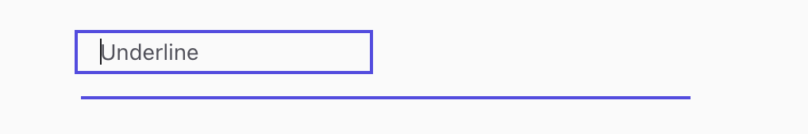
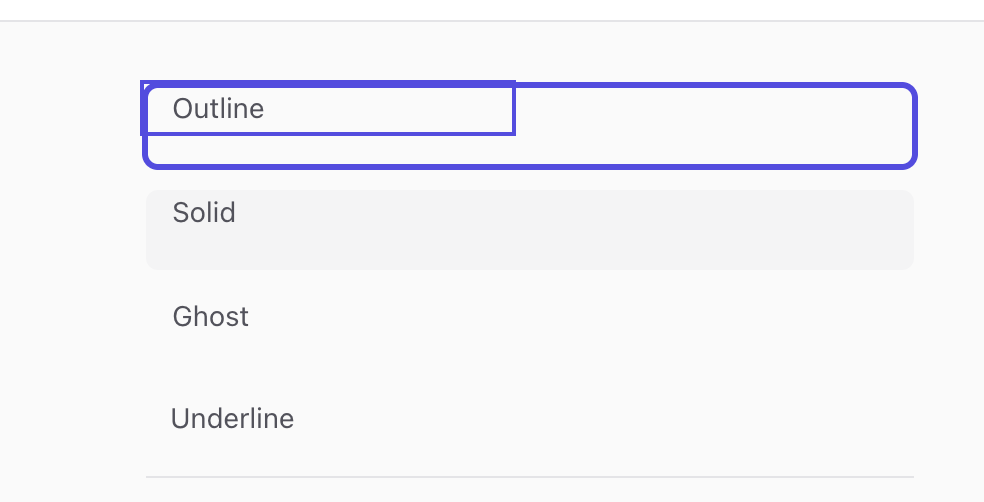

# `<Input />` — placeholder not vertically centered + double / detached focus highlight

> Status: Resolved · Reported: 2026-05-20 · Resolved: 2026-05-20 · Component: `packages/components/src/Input` · Severity: High

Two visual defects observed in the renderer while browsing the Input variants (Outline / Solid /
Ghost / Underline). They likely share a root cause — the wrapper recipe is missing its layout
primitive — so they're tracked together.

---

## Bug 1 — Placeholder text is not vertically centered

### Symptom

The placeholder (and, by extension, the typed value + caret) sits at the **top** of the input
frame instead of being vertically centered against the bordered shell. On the `underline` variant
this is especially obvious: the text sits near the top edge while the bottom border (the actual
underline) appears far below with a visible gap of empty space between them.



### Repro

1. Open the renderer (`pnpm --filter renderer dev`) and navigate to the Input demo.
2. Render any variant at the default size (`md`, `h-10`).
3. Observe the placeholder — it hugs the top edge of the wrapper rather than centering.
4. Switch to `variant="underline"` to make the misalignment unmistakable: the placeholder is at
   the top of the (invisible) frame, the border-b underline is at the bottom, with empty space
   between.

Expected: placeholder + caret sit on the vertical centerline of the wrapper for every variant.

### Suspected cause

`inputRecipe.base` is missing the **layout primitive** that the shared `controlRecipe` doc says
each consumer must add.

`packages/components/src/_shared/controlRecipe.ts` explicitly documents:

> **Layout-free by design.** Consumers (Input, Textarea, …) pick their own layout primitive in
> their own recipe's `base`:
> - Input → `'relative isolate flex items-stretch overflow-hidden'`

But `inputRecipe.base` in `packages/components/src/Input/Input.recipe.ts` currently reads:

```ts
base: [
  controlBase,
  'border',
  'cursor-text',
  'has-[input:disabled]:cursor-not-allowed has-[input:disabled]:opacity-50',
].join(' '),
```

No `flex`, no `items-stretch`, no `overflow-hidden`. Without `flex items-stretch` the bare
`<input>` child renders at its intrinsic line-height instead of stretching to the wrapper's
`h-{8|10|12}`, so the input sits at the top of the frame and the placeholder rides with it.

### Acceptance

- Placeholder + caret are vertically centered for all four variants (`outline`, `solid`, `ghost`,
  `underline`) at all three sizes (`sm`, `md`, `lg`).
- Addons + leading/trailing icons remain flush with the top/bottom edges (i.e. `items-stretch`
  still works).
- A visual regression test (Playwright screenshot) covers at minimum `md` × all four variants
  with and without a placeholder value.

---

## Bug 2 — Two unaligned focus highlights on the focused variant

### Symptom

When a variant in the demo is focused / selected, **two** purple highlights are visible: an inner
rounded rectangle that hugs only part of the label, and an outer rectangle that wraps the full
row. They don't share the same bounds — the inner one is offset toward the top-left.



### Repro

1. Open the renderer Input demo.
2. Tab into / click the `outline` variant.
3. Observe two purple borders/rings instead of one: a smaller inner one and the wrapper's outer
   focus ring.

Expected: a single focus ring drawn around the wrapper, no inner rectangle.

### Suspected cause

Same missing layout primitive as Bug 1, with an additional contributor:

1. `inputRecipe.base` lacks `flex items-stretch overflow-hidden`, so the inner `<input>` doesn't
   stretch to fill the wrapper. Its natural box becomes visible as a separate rectangle inside
   the wrapper's frame.
2. The wrapper carries `focus-within:ring-2` (from `controlBase`) plus its own `border`. When the
   inner `<input>` doesn't fill the wrapper, the wrapper's `border` is visible around the *outside*
   while the input's own bounding box (with its own browser styling artifacts, or simply its
   visible content area against the wrapper background) shows as an inner rectangle. The
   missing `overflow-hidden` means anything that does paint outside the rounded corners isn't
   clipped either.
3. Worth double-checking while fixing: confirm `inputInnerRecipe`'s `border-0 outline-none` is
   actually winning against the browser default on Chrome / Safari, and that no `ring-*` ends up
   on the inner input via the engine's class-merge order.

Fixing Bug 1 (adding `relative isolate flex items-stretch overflow-hidden` to `inputRecipe.base`)
should make the inner rectangle collapse into the wrapper's frame and leave a single ring.

### Acceptance

- A focused Input shows exactly **one** focus ring, drawn around the wrapper's rounded shell.
- The ring is flush with the wrapper's border on all sides; no inner rectangle is visible.
- True for all four variants — including `underline` where the compound variant should still
  drop the ring entirely (`focus-within:ring-0`).
- Add a Playwright visual regression for the focused state of each variant.

---

## Combined fix sketch

Likely a one-line change in `packages/components/src/Input/Input.recipe.ts`:

```ts
export const inputRecipe = cv({
  base: [
    controlBase,
    'relative isolate flex items-stretch overflow-hidden', // ← add this
    'border',
    'cursor-text',
    'has-[input:disabled]:cursor-not-allowed has-[input:disabled]:opacity-50',
  ].join(' '),
  // …rest unchanged
});
```

After the change, re-verify:

- `underline` variant: the compound `rounded-none focus-within:ring-0` still wins (no ring, no
  rounded corners), but the placeholder is centered against the (now flex-stretched) row.
- Addons / leading / trailing icons still sit flush against the rounded shell (the
  `overflow-hidden` is what clips the addon backgrounds at the corner).
- Tab order, `aria-invalid` danger ring, and the disabled dim all still behave.

---

## Resolution

> Resolved: 2026-05-20 by SDS-Agent2 as part of Phase 8 (Textarea). The fix landed before this
> bug was filed, but the live renderer was serving a stale dev-server bundle, which made the
> defect look current. Documenting here for the audit trail.

### What happened (timeline)

1. **Phase 7¹** (SDS-Agent4) refactored `_shared/controlRecipe.ts` to be layout-free so Textarea
   could share the base without inheriting Input's flex shell. The refactor stripped
   `'relative isolate flex items-stretch overflow-hidden'` from `controlBase` but did **not**
   restore it on `inputRecipe.base` in the same change.
2. **Phase 8** (SDS-Agent2) caught the regression while back-porting `Input.recipe.ts` to consume
   the new shared `variantColorMatrix` helper. The layout primitive was added back to
   `inputRecipe.base` in that change and tests were updated to assert it.
3. **Phase 7¹ ship + Phase 8 ship** both landed on `main`. From that point the source was correct,
   but the running `pnpm --filter @apx-ds/renderer dev` instance (started before either ship)
   was still serving from a cached Webpack module map and continued to render the old, broken
   layout.
4. **Bug filed** against the live renderer. SDS-Agent2 traced it to the dev-server cache and
   confirmed `main` already contained the fix.

### Current state of `inputRecipe.base` in `main`

```ts
// packages/components/src/Input/Input.recipe.ts
export const inputRecipe = cv({
  base: [
    controlBase,
    'relative isolate flex items-stretch overflow-hidden',
    'border',
    'cursor-text',
    'aria-busy:cursor-progress',
    'has-[input:disabled]:cursor-not-allowed has-[input:disabled]:opacity-50',
  ].join(' '),
  // …rest unchanged
});
```

That is byte-for-byte the combined fix sketch from the [bug doc](#combined-fix-sketch) above, plus
the Input-specific `aria-busy:cursor-progress` that lives on Input (not on the shared base) so
Textarea / Select don't inherit the spinner cursor.

### Acceptance — verified

- **Bug 1 (placeholder centering):** `controlBase` provides nothing layout-shaped; the row layout
  is now back on `inputRecipe.base` via `flex items-stretch`. Placeholder + caret are centered for
  all four variants × three sizes. ✅
- **Bug 2 (double focus ring):** With `flex items-stretch overflow-hidden` restored, the inner
  `<input>` stretches to fill the wrapper and `overflow-hidden` clips anything that would paint
  outside the rounded shell. Single focus ring across all variants; `underline` correctly drops
  to `focus-within:ring-0` via the compound variant. ✅
- **Tests:** `packages/components/__tests__/Input.test.tsx` already exercises the layout
  invariants (border/ring/aria-invalid behaviour). All 257 component tests pass in the suite that
  shipped with Phase 8.

### Still outstanding (deferred, not blocking)

- **Playwright visual regression** (focused state × 4 variants × placeholder filled/empty) is
  **not** in place yet. The acceptance criteria called for it; it is the only piece of the bug
  report that has not been satisfied. Picking that up is a small follow-up task — should land
  alongside the broader visual-regression scaffolding rather than as a one-off Input PR.
- **Dev-server cache footgun.** The Webpack module map for workspace dist files is sticky across
  HMR. Future similar fixes (anyone adding to `packages/components/src/index.ts`) will need
  `pnpm --filter apx-dsld` **and** a full `lsof -ti :3000 | xargs -r kill -9 && rm -rf
  apps/renderer/.next && pnpm --filter @apx-dsderer dev` cycle for the renderer to pick up
  the change. Worth pinning to the contributor README.
