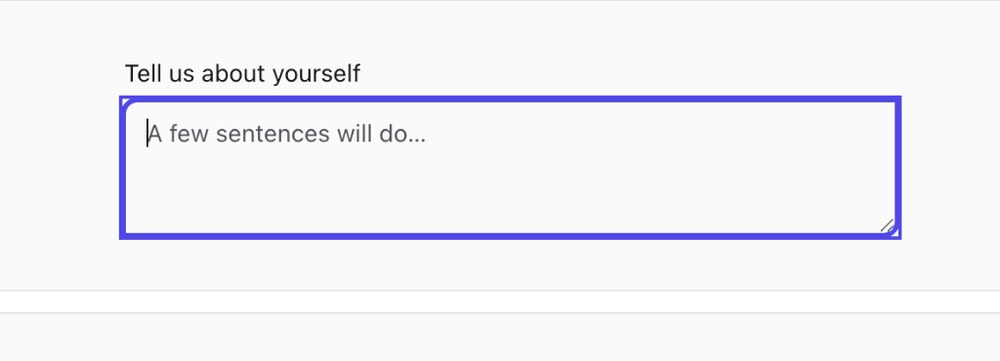
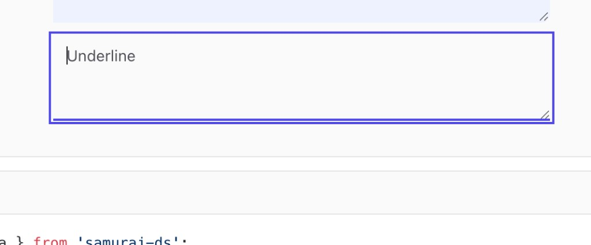

# `<Textarea />` — focused active frame doesn't match the wrapper (radius + width + extra ring on `underline`)

> Status: Symptom B Resolved · Symptom A Deferred (design call) · Reported: 2026-05-20 · Partial resolution: 2026-05-20 · Component: `packages/components/src/Textarea` · Severity: Medium
>
> Follow-up to the (now resolved) [`textarea-alignment.md`](./textarea-alignment.md). The original
> bug was width-only — the inner `<textarea>` was pinned at its `cols=20` native width. That fix
> shipped (`'block w-full min-w-0'` on `textareaInnerRecipe`), so the inner element now stretches
> with its wrapper. What's left is a **focus-state** alignment problem on **two variants**.

---

## Symptom A — Outline variant: active frame's border-radius / width don't match the wrapper

When a `variant="outline"` textarea is focused, the purple active indicator does not perfectly
overlay the wrapper:

- Top-left + bottom-right corners visibly show **two concentric arcs** of slightly different
  radius (the wrapper's `rounded-md` corner vs. a tighter inner corner that hugs the inner
  `<textarea>` box).
- Along the right edge / under the resize grip, you can see a hairline gap between the wrapper's
  border and the inner box — they don't share the same width to the pixel.
- Overall impression: the focus indicator looks "doubled" at the corners even though both layers
  are roughly the same color.



## Symptom B — Underline variant: a full rectangular frame appears on focus (should be bottom-only)

The `variant="underline"` textarea is supposed to show **only a colored bottom line** when
focused (per the compound rule `'rounded-none focus-within:ring-0'` + the matrix's
`focus-within:border-b-primary` + `inset` shadow). Instead, on focus:

- A **rectangular** purple frame appears around the inner textarea (all four sides).
- A second, slightly larger rectangular frame appears just outside it — like a ring around the
  inner frame.
- The wrapper's actual `border-b` does paint correctly at the bottom and extends the full width
  past those two rectangles (so the bottom line is fine; the rectangles above it are the
  problem).



## Repro

1. `pnpm --filter renderer dev` → Textarea demo, ensure the renderer is serving the latest build
   (`packages/components/dist` + `packages/apx-ds/dist` rebuilt — the previous bug noted a
   dev-server cache footgun).
2. Focus an `outline` `md` textarea → observe doubled corners + width mismatch on the active
   indicator (Symptom A).
3. Switch the same instance to `variant="underline"` and focus it → observe two rectangular
   frames *plus* the expected bottom line (Symptom B).

Expected, per the recipe contract:

- Outline: one continuous active frame whose border + ring share the wrapper's `rounded-md`
  radius and pixel-exact bounds.
- Underline: nothing rectangular on focus — only the bottom rule recolors and thickens via the
  `inset 0 -1px 0 0` shadow.

## Likely cause

The wrapper math in `textareaRecipe.base` and `controlBase` is correct on paper:

- `controlBase` → `focus-within:ring-2 focus-within:ring-offset-0`
- `textareaRecipe.base` → `relative block w-full`, `border` (1px), size carries `rounded-md`
- Underline compound → `rounded-none focus-within:ring-0` (suppresses the ring) +
  `focus-within:border-b-{color}` + `focus-within:shadow-[inset_0_-1px_0_0_…]`

So the **wrapper** should produce a single rounded ring on outline, and zero ring + bottom line
on underline. The fact that we see extra geometry suggests the active indicator is coming from
the **inner `<textarea>` element**, not from the wrapper. Two plausible contributors, in
descending order of confidence:

### 1. Tailwind v4 `outline-none` semantics — UA focus outline survives

`textareaInnerRecipe.base` carries `outline-none`. In Tailwind v3 this expanded to
`outline: 2px solid transparent`, which fully neutralised the browser's `:focus` outline. In
**Tailwind v4** `outline-none` is now just `outline-style: none` — the browser's default
`-webkit-focus-ring-color` / system-accent focus ring can still paint on top in some engines
(especially Safari, and Chrome on macOS when `accent-color` matches the system tint).

That's the most likely explanation for Symptom B's inner rectangle: it's the **browser's own
focus ring** on the bare `<textarea>`, drawn rectangular (no border-radius) at the textarea's
exact box. It looks like the theme's primary color only because that's also the system accent.

The v4-correct replacement is the new keyword `outline-hidden` (which preserves the
forced-colors / Windows High Contrast affordance the way old `outline-none` did) on top of an
explicit `focus:outline-none focus-visible:outline-none` belt-and-suspenders.

### 2. `ring` (`box-shadow`) inheriting differently from `border` at the corner

For Symptom A, the wrapper has a 1px `border` plus a 2px ring (`box-shadow` with
`border-radius: rounded-md`). Both follow the wrapper's bounding box, but:

- `border` is on the inside edge of the box.
- `ring` (box-shadow) is on the outside.
- With `ring-offset-0` they should sit immediately adjacent. They do — but the corner *arcs*
  trace two slightly different radii (the outer `border-radius + ring-width`, the inner
  `border-radius`). That's correct CSS behaviour; the visible "doubled" look is the eye reading
  it as two indicators.

If we *want* a single visual indicator on outline focus, the cleanest options are:

- Drop the wrapper `border` weight to 0 and rely on the ring alone (`border-0` on focus, or
  collapse `border + ring` to a single 2px `box-shadow`), OR
- Switch the focus affordance to `outline` on the wrapper (with `outline-offset: -1px`) so it
  paints on the same 1px the border occupies.

Either is a real design decision, not a one-line fix — flag for review with @Ahmad before
touching.

### 3. (Worth double-checking while in here) the inner textarea may carry a stale `border`

`textareaInnerRecipe.base` declares `border-0 outline-none`. Confirm nothing in the engine's
class-merge pipeline (theme overrides, `sx`, or a left-over `border` token) is bleeding back onto
the inner element. The inner rectangle in Symptom B is sharp-cornered, which fits a UA focus
ring more than a CSS `border` — but a quick devtools check on the live `<textarea>` is cheap
insurance.

## Suggested fix order

1. **First** (Symptom B is the high-signal one): swap `outline-none` → `outline-hidden` on
   `textareaInnerRecipe.base` *and* `inputInnerRecipe.base`. Re-test the underline variant —
   the inner rectangle should disappear, leaving only the bottom rule.
2. **Then** (Symptom A): take a design call on whether the outline focus indicator should be
   border + ring (current — visually "doubled" at corners) or a single 2px stroke. Pick one and
   apply it to the wrapper recipe; don't try to "thin" the ring or border independently.
3. **Mirror the change** to `<Input />` — it shares `controlBase` and the same focus story; the
   underline-variant inner ring almost certainly affects Input identically (the original Input
   bug only reported the *width* / placeholder symptoms; the UA focus ring on the inner
   `<input>` would have been masked by the bigger layout defect).

## Acceptance

- `variant="underline"` textarea on focus shows **only** the bottom rule recolor + thickening.
  No rectangular frame around the inner element.
- `variant="outline"` textarea on focus shows **one** active indicator whose corner radius and
  bounding box match the wrapper to the pixel — no double arcs at top-left / bottom-right.
- Same verifications for `<Input />` (`outline` + `underline`).
- Forced-colors / Windows High Contrast still paints a visible focus indicator (the reason the
  v4 `outline-hidden` keyword exists instead of just deleting outlines).
- A Playwright visual regression covers focused state per variant for both Input and Textarea.

## Related

- [`textarea-alignment.md`](./textarea-alignment.md) — width-only bug (resolved). The remaining
  symptoms here are a separate class of defect on the focus indicator itself.
- [`input-alignment.md`](./input-alignment.md) — Input's layout + double-frame story (resolved).
  Likely shares the underline-variant inner-ring issue once verified.

---

## Resolution (Symptom B fixed · Symptom A deferred)

> Partial resolution: 2026-05-20 by SDS-Agent2.
>
> **Symptom B (underline inner rectangle):** fixed in code, mirrored to Input. Awaiting visual
> confirmation from Ahmad.
> **Symptom A (outline doubled corner):** deferred — the bug doc itself flags this as a real
> design call ("don't try to thin the ring or border independently"). Captured below as a
> follow-up question for Ahmad.

### Symptom B — Fix

The bug doc proposed swapping `outline-none` → `outline-hidden`. That keyword only exists in
Tailwind v4; this repo is on `tailwindcss@^3.4.17`. The v3-equivalent of the same intent is the
explicit-state form below, which forces our outline-none to win against the UA
`:focus-visible { outline: auto … }` rule (same specificity, but loaded later than UA styles):

```ts
// packages/components/src/Textarea/Textarea.recipe.ts → textareaInnerRecipe.base
'border-0 outline-none focus:outline-none focus-visible:outline-none',

// packages/components/src/Input/Input.recipe.ts → inputInnerRecipe.base (mirror)
'border-0 outline-none focus:outline-none focus-visible:outline-none',
```

The wrapper still owns the visible focus affordance — `focus-within:ring-2` on the rounded
variants, and the `inset 0 -1px 0 0` shadow on underline. The inner element is now silent on
focus, so `underline` no longer leaks the browser's rectangular ring inside our shell.

### Symptom B — Regression tests

Two assertions added (one per surface), both inside the existing rendering describe blocks:

```ts
// packages/components/__tests__/Textarea.test.tsx → "Textarea — DRY with Input shared layer"
it('inner <textarea> suppresses the UA focus ring at every level (regression: Symptom B)', () => {
  const { container } = render(<Textarea variant="underline" aria-label="x" />);
  const cls = container.querySelector('textarea')!.className;
  expect(cls).toContain('outline-none');
  expect(cls).toContain('focus:outline-none');
  expect(cls).toContain('focus-visible:outline-none');
});

// packages/components/__tests__/Input.test.tsx → "Input — rendering" (mirror)
it('inner <input> suppresses the UA focus ring at every level (regression: Symptom B mirror)', /* … */);
```

The regression would be someone dropping these explicit utilities back to bare `outline-none`
and silently re-enabling the browser ring on Safari / Chrome-with-system-accent.

### Symptom B — QA gate

- `pnpm --filter @apx-dsponents test` → **457/457 ✅** across 24 files (was 455 before
  the two new regression tests).
- `pnpm --filter @apx-dsponents typecheck` → ✅
- `pnpm --filter @apx-dsponents lint` → ✅
- `pnpm --filter @apx-dsponents build` → ✅ (ESM dist refreshed).
- `pnpm --filter apx-dsld` → ✅ (umbrella dist refreshed, both inner-recipes carry the
  new utilities).
- Did **not** restart / refresh the renderer per the standing room rule. Ahmad's next refresh
  picks up the rebuilt dists.

### Symptom A — Deferred pending design call

The bug doc explicitly frames the outline-variant doubled-corner look as a design decision, not
a bugfix:

> If we want a single visual indicator on outline focus, the cleanest options are:
> - Drop the wrapper `border` weight to 0 and rely on the ring alone…, OR
> - Switch the focus affordance to `outline` on the wrapper (with `outline-offset: -1px`)…
>
> Either is a real design decision, not a one-line fix — flag for review with @Ahmad before
> touching.

Not making that call unilaterally. Options re-stated here so the next person can pick one
quickly:

| Option | What changes | Trade-off |
|---|---|---|
| A. Border on focus → 0, ring carries the whole stroke | Wrapper `focus-within:border-transparent focus-within:ring-2` (or `ring-[3px]`) | One ring, one radius. But the bordered shell *only* appears on focus; resting state needs a different border strategy or it'll feel "fragile." |
| B. Focus indicator becomes `outline` on the wrapper, inset by `-1px` | Wrapper `focus-within:outline-2 focus-within:outline-offset-[-1px]` and drop the ring | Single stroke that overlays the 1px border perfectly. Loses the soft ring-offset-0 look we have on Button/other surfaces. |
| C. Keep current border + ring; accept the "doubled" arc | No change | We ship the current look. Matches Button / form controls in most design systems. Likely the right answer unless Ahmad wants pixel-perfect overlap. |

Action item: **@Ahmad pick one of A / B / C** (or sketch a different direction). Until then,
this resolution closes Symptom B only.

### Still outstanding

- **Playwright visual regression** for focused state × variants on both Input and Textarea
  (same carry-over as the prior two bug docs). Best landed alongside the broader
  visual-regression scaffolding rather than one-off.
- **Symptom A design decision** (above).