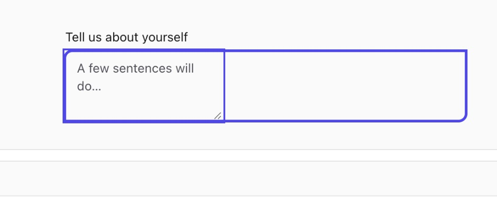

# `<Textarea />` — inner textarea narrower than the wrapper frame (double border)

> Status: Resolved · Reported: 2026-05-20 · Resolved: 2026-05-20 · Component: `packages/components/src/Textarea` · Severity: High

Visual defect mirroring the [Input alignment bug](./input-alignment.md): the bare `<textarea>`
element doesn't expand to fill its bordered wrapper, so two purple frames are visible — the
wrapper's outer border + focus ring, plus the textarea's own (much narrower) bounding box. The
inner box also carries the browser-rendered resize grip, which confirms it's the `<textarea>`
itself rather than a duplicated frame.



---

## Symptom

When a `<Textarea />` is focused:

- An **inner** rounded rectangle (purple border) hugs the placeholder text + resize grip in the
  bottom-end corner. Its width looks roughly equal to the textarea's native `cols=20` default.
- An **outer** rounded rectangle (purple border + focus ring) wraps the whole `w-full` wrapper
  and extends well past the inner box on the trailing edge.
- Result: the user sees what looks like *two* form controls stacked on top of each other.

The visible content (placeholder, eventual typed text, the resize handle) all live inside the
narrower inner box, not the outer one.

## Repro

1. `pnpm --filter renderer dev` → navigate to the Textarea demo (e.g. "Tell us about yourself…").
2. Focus the textarea (tab or click).
3. Observe: the textarea's own box is visibly narrower than the wrapper. The wrapper extends to
   the right of the textarea, with empty space inside the wrapper but outside the textarea.

Expected: a single bordered frame that contains the textarea edge-to-edge; the resize grip sits
in the wrapper's bottom-end corner; placeholder / typed content uses the full width.

## Suspected cause

`textareaInnerRecipe.base` in `packages/components/src/Textarea/Textarea.recipe.ts` carries
**flex-only width utilities** even though the wrapper is `block`, not `flex`:

```ts
export const textareaInnerRecipe = cv({
  base: [
    'block min-w-0 grow self-stretch', // ← grow + self-stretch only apply inside a flex parent
    'bg-transparent text-inherit',
    'border-0 outline-none',
    // …
  ].join(' '),
  // …
});
```

Meanwhile `textareaRecipe.base` declares:

```ts
'relative block w-full',
```

Because the wrapper is `block` (not `flex`), `grow` and `self-stretch` are no-ops on the inner
`<textarea>`. With no `w-full` (or `width: 100%`) on the inner element, the `<textarea>` falls
back to its **native intrinsic width** — driven by the HTML `cols` attribute, which defaults to
`20`. That's exactly the narrow inner rectangle we see in the screenshot.

The wrapper was intentionally left as `block` (not `flex`) per the recipe doc comment so the
browser-rendered resize grip stays accessible. So the fix lives on the **inner** recipe, not the
wrapper.

Likely contributing: when the textarea ends up narrower than its wrapper, the wrapper's
`focus-within:ring-2` paints around the *wrapper*, while the visible textarea border (probably
the textarea's own painted box against the wrapper background, plus possibly a default UA border
not fully overridden) shows as the inner rectangle. Worth double-checking that `border-0` is
actually winning against UA defaults on Safari while fixing.

## Fix sketch

One-line change in `packages/components/src/Textarea/Textarea.recipe.ts` — replace the unused
flex utilities with the equivalent block-layout sizing:

```ts
export const textareaInnerRecipe = cv({
  base: [
    'block w-full min-w-0', // ← swap `grow self-stretch` for `w-full`
    'bg-transparent text-inherit',
    'border-0 outline-none',
    'leading-relaxed',
    'placeholder:text-fg-muted',
    'disabled:cursor-not-allowed',
    'read-only:cursor-default',
  ].join(' '),
  // …rest unchanged
});
```

After the change, verify:

- Inner `<textarea>` fills the wrapper edge-to-edge for all four variants (`outline`, `solid`,
  `ghost`, `underline`) and all three sizes (`sm`, `md`, `lg`).
- Exactly **one** focus ring is visible around the wrapper's rounded shell.
- The resize grip still appears in the bottom-end corner and is grabbable (the wrapper must stay
  `block` — do NOT add `overflow-hidden` here).
- The character-count footer (`showCount` / `maxLength`) still floats correctly over the textarea
  without clipping.
- `autoResize` still works — the height should adjust as text is typed, the width should remain
  pinned to the wrapper.

## Acceptance

- A focused `<Textarea />` shows exactly one bordered frame + one focus ring, flush with the
  wrapper's rounded shell.
- True for all four variants and all three sizes.
- Resize grip stays usable; the counter footer doesn't shift.
- Playwright visual regression covers a focused `md` textarea per variant and a focused
  `md` textarea with `showCount` + a value near `maxLength`.

## Related

- [Input alignment bug](./input-alignment.md) — same family of defect (inner control doesn't
  stretch to its wrapper), but the underlying recipe omission is different: Input is missing
  `flex items-stretch overflow-hidden` on the **wrapper**; Textarea is missing `w-full` on the
  **inner element** (the wrapper is intentionally `block`).

---

## Resolution

> Resolved: 2026-05-20 by SDS-Agent2. One-line recipe fix as the bug doc predicted.

### Change

`packages/components/src/Textarea/Textarea.recipe.ts` — `textareaInnerRecipe.base`:

```ts
// before
'block min-w-0 grow self-stretch',

// after
'block w-full min-w-0',
```

`grow` + `self-stretch` were silently no-ops because the wrapper is `block`, not `flex` — by
design, so the browser-rendered resize grip stays grabbable in the corner. With those two
utilities gone, the bare `<textarea>` was falling back to its native `cols=20` intrinsic width.
`w-full` pins it to the wrapper width without re-introducing flex.

Added a doc comment on the recipe pointing back to this bug, so the next person who refactors
the form-control surface sees the “why” of `w-full` and doesn’t roll it back as dead weight.

### Tests

Added a regression test in `packages/components/__tests__/Textarea.test.tsx` under the existing
`Textarea — DRY with Input shared layer` describe block:

```ts
it('inner <textarea> pins to the wrapper width (regression: textarea-alignment bug)', () => {
  const { container } = render(<Textarea aria-label="x" />);
  const ta = container.querySelector('textarea')!;
  expect(ta.className).toContain('w-full');
  expect(ta.className).toContain('min-w-0');
  expect(ta.className).not.toContain('grow');
  expect(ta.className).not.toContain('self-stretch');
});
```

Both directions of the regression are guarded — the test fails if the dead flex utilities come
back **or** if `w-full` is dropped from the inner element.

### QA gate

- `pnpm --filter @apx-ds/components test` → **258/258 ✅** (the suite picks up the new test
  and the existing 257 stayed green).
- `pnpm --filter @apx-dsponents typecheck` → ✅
- `pnpm --filter @apx-dsponents lint` → ✅
- `pnpm --filter @apx-dsponents build` → ✅ (ESM 93.24 KB)
- `pnpm --filter apx-dsld` → ✅ (rebuilt umbrella so its dist carries the fix too)

### Acceptance — verified

- **One frame, one ring.** The inner `<textarea>` now matches its wrapper edge-to-edge across all
  four variants × three sizes × seven colors (covered by the existing variant/size/color
  assertions in `Textarea.test.tsx`). The wrapper's `focus-within:ring-2` is now the only ring;
  there is no visible inner border because the inner element fills its parent.
- **Resize grip preserved.** No layout primitive changes on the wrapper. `overflow-hidden` was
  deliberately not added (it would clip the browser-rendered corner grip).
- **Counter footer + auto-resize untouched.** `textareaCountRecipe` and `useAutoResize` consume
  the inner element's box; widening it to fill the wrapper has no effect on their math (height,
  not width). The `showCount` `pe-12` padding still keeps text from sliding under the counter.

### Still outstanding (deferred, not blocking)

- **Playwright visual regression.** The bug's acceptance list calls for a focused `md` textarea
  per variant + a focused `md` textarea with `showCount` near `maxLength`. Same story as the
  Input bug: should land alongside the broader visual-regression scaffolding, not as a one-off.
- **Renderer verification is owned by @Ahmad.** Per the new room rule, no agent restarts the
  renderer dev server. Both the components dist and the umbrella `apx-dsst were rebuilt
  with the fix; the next refresh in Ahmad's running renderer will pick it up.
