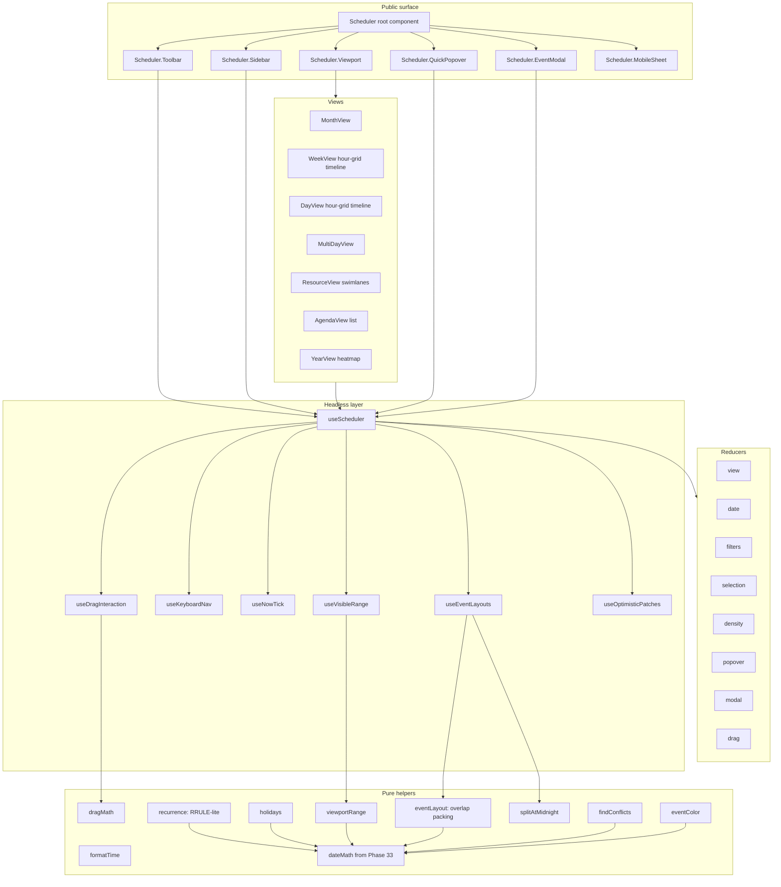

# Phase 58 — `<Scheduler />` (complex / Tier 3)

> Status: **PR 1 + PR 2 + most of PR 3 + most of PR 7 SHIPPED · remaining PRs Pending** · **Tier: COMPLEX (Tier 3)** · Depends on: Phase 33 (Calendar) · Phase 18 (Popover) · Phase 19 (Modal) · Phase 20 (Drawer) · Phase 22 (Menu) · Phase 23 (Select) · Phase 30 (ToggleGroup) · Phase 17 (Tooltip) · Phase 34 (Combobox) · Phase 48 (TagsInput) · Phase 35 (CommandPalette — optional) · Phase 55 (Table — Agenda view) · Phase 46 (TreeView — resource grouping) · Phase 7 (Input) · Phase 6 (Button) · Phase 12 (Badge) · Phase 14 (Card) · Phase 9 (Checkbox) · Phase 49 (Field) · Engine `<I18nProvider>` (established by Phase 27) · Optional engine `useRovingTabindex` (RFC under `pending/core/01`) · Blocks: nothing immediate, but unlocks future `<TimePicker>` / `<DateTimePicker>` / `<MeetingRoomPlanner>` / ICS sync primitives.
>
> **Estimated effort: 4–6× the largest Batch 1/2 plan, comparable to Phase 27 DataGrid.** This is the deepest non-data-grid component the DS will ship in v0.x. Plan to split implementation across nine PRs (see "Suggested PR Split" near the end).

> ### Implementation status snapshot (last updated 2026-05-26 — see `packages/components/src/Scheduler/`)
>
> **Shipped — PR 1 (full) + PR 2 (full) + PR 3 (drag-create only) + PR 7 (full minus `SchedulerSettingsMenu`):**
>
> _Types + helpers + headless (PR 1):_
>
> - Full public type surface (`Scheduler.types.ts`, ~440 lines) — events, drafts, recurrence, holidays, calendars, resources, filters, state, render-slot ctx, hook ctx, error shape, persistence shape, i18n surface.
> - All 10 pure helpers (`helpers/`): `dateMath` (local — Phase 33 not yet shipped; will be promoted out of Scheduler when `<Calendar>` lands), `eventLayout` (overlap-packing + all-day stacking), `recurrence` (RRULE-lite — daily / weekly w/ byDay / monthly w/ byMonthDay + bySetPos / yearly + `until` + `count` + `exceptions`), `holidays` (built-in ~20-region set + Easter algorithm + locale-to-region resolver + day-key indexer), `dragMath` (pointer→time / pointer→day / move / resize / range), `viewportRange` + `shiftAnchor`, `splitAtMidnight` (multi-day → per-day segments), `findConflicts`, `eventColor` + `isNamedColor`, `formatTime` (locale-aware via `Intl`).
> - Headless `useScheduler()` hook (~700 lines): controlled + uncontrolled state, recurrence expansion, holidays auto / provider / explicit, calendar / resource / search / dateRange / custom filters, drag-create state machine, optimistic CRUD wrappers, persistence (local / session / custom adapter), `<I18nProvider>` plumbing. Returns `calendars` alongside `calendarById` so chrome subparts can iterate sources in declaration order.
> - Single-reducer state machine (`schedulerReducer`) — 19 actions covering view / date / filters / selection / density / popover / modal / drag / errors.
>
> _Views + core parts (PR 2 + early PR 3):_
>
> - 4 of 8 views: `MonthView` (full 6×7 grid, today + holidays + click-to-create + per-day event chips with "+N more" overflow), `TimeGridView` (shared by week / workWeek / day / multiDay — hour grid + sticky header + all-day band + drag-to-create with snap-to-grid + now-indicator + business-hours dim + overlap-packed events), `AgendaView` (Google-Calendar "Schedule" list). `YearView` + `ResourceView` ship as informative stubs (see `views/StubViews.tsx`).
> - Core parts: `SchedulerToolbar` (prev/next/today + range title + view-switcher `<ToggleGroup>` + optional chrome trio), `SchedulerEventCard` (4 variants × 7 colors × 3 densities, all-day flavour, hover-revealed resize handles, ARIA + keyboard), `SchedulerNowIndicator` (DST-safe minute-pinned tick — z-index above events), `SchedulerTimeAxis` (24-hour absolute-positioned labels), `SchedulerHolidayBanner` (banner + badge, scoped to the visible range + deduped), `SchedulerQuickPopover` (Google-Calendar-style: title input + Event/Task/Appointment tabs + date line + guest / location / description rows + More options / Save — composes `<Popover>` + `<Input>` + `<Button>`).
> - Auto-scroll on mount + view/density change lands the time grid 30 min before working hours start.
>
> _Chrome + sidebar + filters (PR 7):_
>
> - `SchedulerSidebar` (260-px leading rail — default layout = mini-month + calendars + holiday toggle; `children` replaces the layout wholesale).
> - `SchedulerMiniMonth` (local-state month grid driven by `computeMonthGrid`; clicking jumps `state.date`; ready for promotion to a thin wrapper around Phase 33 `<Calendar>` once that lands).
> - `SchedulerCalendarList` (checkbox list with color swatches; writes `filters.calendarIds`).
> - `SchedulerSearchInput` (200 ms debounced; writes `filters.search`).
> - `SchedulerDensitySelect` (`ToggleGroup` for compact / standard / comfortable).
> - `SchedulerFilterMenu` (`Popover` hosting calendars + holiday switch + "Clear all" gated on `activeCount > 0`, with a count badge on the trigger).
> - `SchedulerHolidayToggle` (`Switch` for `filters.holidays.show`).
> - `SchedulerHolidayRegionFilter` (`Menu` with checkbox-items over ~20 ISO regions; writes `filters.holidays.regions`).
> - Root-level `sidebar` / `filters` props resolve to a typed `SchedulerChromeFlags` value on context; the default toolbar reads it to render the chrome trio, the body reads it to render the sidebar.
> - `SchedulerFilters` type relaxed so optional keys accept `| undefined` — consumers can clear filter slots without rest-spread gymnastics.
>
> _Cross-cutting:_
>
> - 35 themeable recipes covering every slot (28 original + 7 added for sidebar / mini-month / calendar-list / filter-count badge).
> - Default English `SchedulerTranslations` + namespace-scoped i18n provider merge.
> - Top-level `<Scheduler />` wired up + `Object.assign` compound assembly (`Scheduler.Sidebar`, `Scheduler.MiniMonth`, `Scheduler.CalendarList`, `Scheduler.SearchInput`, `Scheduler.DensitySelect`, `Scheduler.FilterMenu`, `Scheduler.HolidayToggle`, `Scheduler.HolidayRegionFilter`, plus the originals).
> - Recipe + helpers + types + part-props re-exported from `packages/components/src/index.ts`.
> - Typecheck clean (within Scheduler scope), lint clean, build green.
>
> _Examples shipped:_ `Basic`, `Day`, `Month`, `MultiDay`, `Agenda`, `ReadOnly`, `Holidays`, `MultipleCalendars`, `WithSidebar`, `WithFilters`, `FullChrome`.
>
> **Day-demo bug fixes (2026-05-24 / 2026-05-25 — landed alongside PR 7 work, not separately documented in `plans/bugs/`):**
>
> - Time grid wasn't scrolling past auto-scroll position. Cause: `schedulerRootRecipe` had no `h-full` so the body's `flex-1 overflow-hidden` had nothing to flex into; `schedulerTimeGridRecipe` used `h-full` which fought the 1152 px content. Fix: root gained `h-full`, time grid switched to `min-h-full`.
> - Clicking an existing event triggered drag-create instead of opening the view popover. Cause: event-card wrapper didn't stop `pointerdown`, so it bubbled to the column's drag handler. Fix: wrapper now stops `pointerdown`; click still bubbles to the card's own `onClick` (popover opens in view mode).
> - Now indicator rendered under event cards. Cause: both at `z-[1]`, events later in DOM. Fix: `schedulerNowIndicatorRecipe` → `z-[3]`.
> - Header column alignment + holiday banner scoping + toolbar title squeeze + over-prominent grid lines + barely-visible event-card backgrounds were all addressed in the same loop (see prior commits).
>
> **Collateral DataGrid build-blocker fixes (also landed in the same session):**
>
> - `DataGridCellEditor` / `DataGridColumnMenu` / `DataGridExpandCell` were importing `'../../Input'` / `'../../Button'` (folder imports with no `index.ts`); switched to `'../../Input/Input'` / `'../../Button/Button'` matching how `src/index.ts` itself re-exports.
> - `DataGridResizeHandle` had a mixed `?? || ||` expression ESBuild rejects; added parentheses.
> - `DataGridColumnMenu` props now `Omit<…, 'type' | 'color'>` (native HTML `color` collided with `Button`'s `ResponsiveValue<ButtonColor>`); dropped invalid `align="end"` from `<Menu.Content>`. These were unblocking the umbrella `apx-ds` dist rebuild; they're not part of the Scheduler scope but the dist couldn't ship without them.
>
> **Deferred to follow-up PRs (per "Suggested PR Split" below):**
>
> - Drag-move / drag-resize commit path on existing events (the headless `useDragInteraction` wiring and recipes are already in place; the views currently only expose drag-create). PR 3 remainder.
> - `ResourceView` swimlane renderer (helpers + state are already in place; layer is rendering only). PR 4.
> - `YearView` 12-month heatmap. PR 5.
> - Full `<Scheduler.EventModal>` editor (recurrence picker + reminder list + attendee picker + visibility / status select), `SchedulerMobileSheet` `<Drawer>` fallback for QuickPopover. PR 6.
> - `SchedulerSettingsMenu` (week-start day, time-format 12/24, working hours, working days, locale, theme). PR 7 remainder — held until the settings UX is specified.
> - Promote `helpers/dateMath` to Phase 33 `<Calendar>` once it lands; rewrite `SchedulerMiniMonth` as a thin wrapper around `<Calendar>`. Tracked separately under Phase 33.
> - Persistence URL adapter, server-side `onRangeChange` + `manualEvents` recipes, full recurrence "edit this and following" / "all" implementations, locale bundles (`heSchedulerTranslations`, `arSchedulerTranslations`). PR 8.
> - Roving-tabindex engine promotion + cross-cell keyboard map (Tab / Arrows / Home / End / PageUp / PageDown / Enter / Escape / Delete). PR 8.
> - Visual snapshot suite, perf benchmark, full a11y sweep (axe + screen-reader), `README.mdx`. PR 9.

---

## Objective

Ship the canonical **scheduling primitive** — `<Scheduler />`. Scheduler is the second Tier-3
component in the DS (after DataGrid) and the **culmination of every date / overlay / form
primitive** shipped so far: it consumes Calendar (Phase 33), Popover, Modal, Drawer, Menu, Combobox,
ToggleGroup, Tooltip, Badge, Field, Checkbox, Table, TreeView, `<I18nProvider>`, and the engine's
positioning / focus-trap / escape-stack primitives — and proves they compose into a production-grade
calendar application with **Google Calendar parity**.

Hard requirements (per the brief):

1. **Fully featured calendar** with CRUD props — same component renders as view-only OR editable; per-event editable predicate also supported.
2. **Timeline view — emphasized as critical** — day/week hour-grid timeline AND resource swimlanes ship as two of the Scheduler's views. Both support drag-to-create, drag-to-move, drag-to-resize, snap-to-grid, overlap packing, multi-day spans, current-time "now" line, business-hours / off-hours shading.
3. **Takes holidays** — either as a literal `holidays={Holiday[]}` list or via a `holidaysProvider(year, locale) => Holiday[]` callback; locale-aware default set for ~20 common locales; render in month / week / day / agenda; filterable on/off.
4. **On-select popup** — when a user clicks an empty time slot or finishes a drag-selection, a `<Scheduler.QuickPopover>` opens anchored to the selected range. UX matches the Google Calendar screenshot the user provided: Title input + Event / Task / Appointment ToggleGroup tabs + date-time row + Add guests / Add Google Meet / Add location / Add description rows + "More options" link (opens full Modal editor) + Save button.
5. **Filters** — `<Scheduler.Filters>` slot covering visible-calendar checkboxes, resource multi-select, text search, date-range, holiday toggle, custom predicate. Wired through `useScheduler()`.
6. **Change view look & feel** — `variant` × `color` × `density` × `size` × per-event color × per-calendar color × theme `styleOverrides`. All five DS override layers honored.
7. **Google Calendar functional parity** — month / week / work-week / day / multi-day / agenda / year / resource views; recurring events (RRULE-lite); drag-and-drop; reminders; attendees; multiple overlaid calendars; mini-month side panel; keyboard nav; locale + RTL; print-friendly chrome (basic).

Plus the table-stakes scheduler features:

- Toolbar with prev / next / today nav, view switcher, search, filters menu, density toggle, settings menu.
- Event categories / colors / per-calendar palette.
- Conflict detection on the same resource (callback fires; UI shows a hatched overlay).
- Server-side mode — `events` prop is whatever subset the consumer fetched for `state.visibleRange`; `onRangeChange` fires when the visible window changes so consumers can re-fetch.
- Optimistic CRUD with rollback on error.
- Persistence (view, date, density, filters) via optional `storage` adapter (mirrors DataGrid).
- Full ARIA Grid + Listbox patterns + keyboard nav.
- 0 axe violations.

---

## What This Component Proves

- **The DS can host a second truly-complex component** — Scheduler is to "time-based data" what DataGrid is to "tabular data". Same composition discipline, no new low-level primitives.
- **Calendar (Phase 33) is correctly factored** — its `dateMath.ts` + `computeMonthGrid` + `useCalendar` hook serve a Tier-3 consumer without modification. If anything has to be added, that's a signal Phase 33's API was under-specified.
- **`<Popover>` + `<Modal>` + `<Drawer>` + `<Menu>` + `<Combobox>` + `<ToggleGroup>` + `<Field>` compose into a production application surface.** Quick-create popover, full event editor modal, mobile event sheet (Drawer), right-click context menu, attendee picker, view switcher, form fields — each is one of the shipped overlays, not a re-implementation.
- **The headless / DOM split scales beyond DataGrid.** `useScheduler()` is the public contract; views are pluggable; consumers can swap any view for a custom one without forking.
- **`<I18nProvider>` reaches consumer #6 (or later)** — DataGrid, Pagination, Breadcrumbs, Calendar, Combobox, **Scheduler** — and proves locale/RTL/Hijri concerns are uniform across the DS.
- **Pure-`Intl` date math is sufficient at scheduler scale.** No `date-fns` / `dayjs` / `luxon` / `rrule.js` / `moment` — Scheduler ships a ~150 LoC pure `recurrence.ts` RRULE-lite engine on top of Phase 33's `dateMath`. We pay roughly **0 KB** for the date layer.

---

## Naming — Why "Scheduler", Not "Calendar" or "Timeline"

`Calendar` is the **date-picker primitive** shipped in Phase 33 (a 4–5 week month grid for selecting
one or more dates inside a `<DatePicker>`). `Timeline` is the **activity-feed component** shipped in
Phase 45 (a vertical/horizontal/alternating list of dated events). Both names are claimed and both
components are tiny relative to this one.

`Scheduler` is the application-level component. Its hour-grid day/week view is internally referred
to as "the timeline" (per the user's brief, "Timeline is important") — but the *component name* on
the public surface is **Scheduler**, with views selected via `view="week"` / `view="day"` /
`view="resource"`. This matches how Google Calendar, Outlook, Schedule-X, and react-big-calendar all
unify the same concept.

If a consumer truly wants only the standalone timeline, they import `<Scheduler view="day" />`
(single view, no toolbar via `toolbar={false}`, no filters via `filters={false}`) — same component,
configured down.

---

## Public API — High Level

```tsx
import { Scheduler } from 'apx-ds';import type { SchedulerEvent, SchedulerView, Holiday } from 'apx-ds';
interface Event extends SchedulerEvent {
  id: string;
  title: string;
  start: Date;
  end: Date;
  allDay?: boolean;
  calendarId?: string;          // for multi-calendar overlay + filter
  resourceId?: string;          // for swimlane view
  color?: string;               // per-event override; else inherits calendar color
  description?: string;
  location?: string;
  attendees?: { email: string; name?: string; response?: 'accepted' | 'tentative' | 'declined' | 'needsAction' }[];
  status?: 'confirmed' | 'tentative' | 'cancelled';
  visibility?: 'default' | 'public' | 'private';
  recurrence?: RecurrenceRule;  // RRULE-lite
  reminders?: { minutesBefore: number; method?: 'popup' | 'email' }[];
  editable?: boolean;           // per-event override of the top-level `readOnly`/`editable`
  meta?: Record<string, unknown>;
}

const events: Event[] = [/* … */];

const holidays: Holiday[] = [
  { id: 'us-thanksgiving-2026', date: '2026-11-26', name: 'Thanksgiving', region: 'US' },
  { id: 'il-rosh-hashanah-2026', date: '2026-09-12', name: 'Rosh Hashanah', region: 'IL' },
];

<Scheduler
  /* data */
  events={events}
  holidays={holidays}
  calendars={[
    { id: 'work',     name: 'Work',     color: 'primary',   visible: true },
    { id: 'personal', name: 'Personal', color: 'secondary', visible: true },
    { id: 'holidays', name: 'Holidays', color: 'neutral',   visible: true },
  ]}
  resources={[
    { id: 'room-a', name: 'Conference A', group: 'Rooms' },
    { id: 'room-b', name: 'Conference B', group: 'Rooms' },
    { id: 'alice',  name: 'Alice',        group: 'People' },
    { id: 'bob',    name: 'Bob',          group: 'People' },
  ]}
  /* view */
  view="week"                         // 'month' | 'week' | 'workWeek' | 'day' | 'multiDay' | 'agenda' | 'year' | 'resource'
  date={new Date(2026, 4, 24)}
  onViewChange={setView}
  onDateChange={setDate}
  onRangeChange={(range) => refetchEvents(range)}
  /* editability */
  readOnly={false}                    // true → no CRUD UI; events still display
  /* CRUD callbacks */
  onEventCreate={async (draft) => {/* …optimistic create… */}}
  onEventUpdate={async (event, patch) => {/* …optimistic patch… */}}
  onEventDelete={async (id) => {/* … */}}
  onEventMove={async (event, { start, end, resourceId }) => {/* …optimistic move… */}}
  onEventResize={async (event, { start, end }) => {/* …optimistic resize… */}}
  onConflict={({ moved, conflicts }) => toast.warning('Conflicts with N other events')}
  /* selection */
  selectedEventId={selectedId}
  onSelectedEventChange={setSelectedId}
  /* visual */
  variant="solid"                     // 'solid' | 'outline' | 'soft' | 'minimal'
  size="md"                           // 'sm' | 'md' | 'lg'
  color="primary"
  density="standard"                  // 'compact' | 'standard' | 'comfortable'
  /* time grid */
  hourHeight={48}                     // px per hour in week/day view
  snapMinutes={15}                    // 5 | 15 | 30 | 60
  workingHours={{ start: '09:00', end: '18:00' }}
  workingDays={[1, 2, 3, 4, 5]}       // 0=Sun … 6=Sat
  timeFormat="12h"                    // '12h' | '24h' (locale default if undefined)
  /* locale */
  locale="en-US"
  weekStartsOn={undefined}            // default from locale
  showWeekNumbers={false}
  /* features */
  multiDayCount={4}                   // for view="multiDay"
  showNowIndicator={true}
  showHolidays={true}
  enableDragCreate={true}
  enableDragMove={true}
  enableDragResize={true}
  enableRightClickMenu={true}
  /* slots (override defaults) */
  renderEvent={({ event, view }) => <CustomEventCard event={event} />}
  renderQuickPopover={({ draft, save, more, cancel }) => <CustomQuickPopover {...} />}
  renderEventModal={({ event, save, delete: del, cancel }) => <CustomModal {...} />}
  /* toolbar toggles (or `toolbar={false}` / `<Scheduler.Toolbar>` slot for full control) */
  toolbar={true}
  filters={true}
  miniMonth={true}
  /* persistence */
  storage="local"
  storageKey="scheduler-v1"
  /* i18n */
  translations={heSchedulerTranslations}
  /* a11y */
  aria-label="Team calendar"
  /* misc */
  className=""
  sx={{}}
/>
```

### Server-side mode

```tsx
<Scheduler
  events={response.events}
  state={{ view, date, filters }}
  onStateChange={({ view, date, filters }) => setQueryParams({ view, date, filters })}
  onRangeChange={({ start, end }) => fetchEvents({ start, end })}
  loading={isFetching}
/>
```

### Compound / headless mode (escape hatch — full layout control)

```tsx
const scheduler = useScheduler({ events, view, date, /* … */ });

<Scheduler.Root scheduler={scheduler}>
  <Scheduler.Toolbar>
    <Scheduler.NavButtons />              {/* prev / next / today */}
    <Scheduler.DateTitle />               {/* clickable → MiniMonth jump popover */}
    <Scheduler.ViewSwitcher />            {/* ToggleGroup */}
    <Scheduler.SearchInput />             {/* Combobox-async */}
    <Scheduler.FilterMenu />              {/* Menu w/ filter form */}
    <Scheduler.DensitySelect />
    <Scheduler.SettingsMenu />
  </Scheduler.Toolbar>

  <Scheduler.Layout>
    <Scheduler.Sidebar>
      <Scheduler.MiniMonth />
      <Scheduler.CalendarList />          {/* per-calendar visibility checkboxes */}
      <Scheduler.ResourceTree />          {/* group/collapse resources */}
      <Scheduler.HolidayToggle />
    </Scheduler.Sidebar>

    <Scheduler.Viewport>
      {scheduler.view === 'month'    && <Scheduler.MonthView    />}
      {scheduler.view === 'week'     && <Scheduler.WeekView     />}
      {scheduler.view === 'workWeek' && <Scheduler.WorkWeekView />}
      {scheduler.view === 'day'      && <Scheduler.DayView      />}
      {scheduler.view === 'multiDay' && <Scheduler.MultiDayView />}
      {scheduler.view === 'agenda'   && <Scheduler.AgendaView   />}
      {scheduler.view === 'year'     && <Scheduler.YearView     />}
      {scheduler.view === 'resource' && <Scheduler.ResourceView />}
    </Scheduler.Viewport>
  </Scheduler.Layout>

  <Scheduler.QuickPopover />             {/* portaled, opens on slot-select / drag */}
  <Scheduler.EventModal />               {/* portaled, opens on event open / More options */}
  <Scheduler.MobileSheet />              {/* Drawer fallback for QuickPopover on small screens */}
</Scheduler.Root>
```

The **high-level** `<Scheduler {…props} />` form internally renders the same default layout. The
headless form lets consumers drop the sidebar entirely, embed in a Card, render two Schedulers
side-by-side sharing state, etc.

---

## API — Decisions

| Decision | Why |
| -------- | --- |
| **One root `<Scheduler />` hosts all views** | Same data model, same drag interactions, same keyboard pattern. Separate `<EventCalendar>` + `<TimelineGrid>` components would duplicate ~70% of internals. Mirrors Google Calendar / Outlook / Schedule-X / react-big-calendar. |
| **`events` is a flat array; views project it**  | Single source of truth. Recurring events are *expanded* by `recurrence.ts` per visible range — consumers store rules, not instances. |
| **`readOnly` is global; per-event `editable` overrides** | Mirrors DataGrid's column-level overrides. Common pattern: the whole calendar is editable, but holidays/external-feed events are not. |
| **Drag interactions are opt-in per affordance (`enableDragCreate` / `enableDragMove` / `enableDragResize`)** | Touch UX, performance, and accessibility all benefit from disabling individual gestures rather than an all-or-nothing toggle. |
| **Quick-create popover and full editor are both DS-provided defaults, both overridable via `render*` slots** | Common case: don't write a popover. Custom case: render your own with `useScheduler()` for state + actions. |
| **Recurrence is RRULE-lite, not full iCal RRULE** | iCal RRULE has ~20 fields; we ship the 6 that cover ~95% of consumer recurrence (`freq`, `interval`, `byDay`, `byMonthDay`, `until`, `count`). Full RRULE is a follow-up plan if real demand emerges. |
| **Holidays are a separate data type from events** | They render differently (badge in cell + tooltip vs. event card), they're toggleable as a whole, and they have a `region` field for multi-region calendars. Mixing them into `events` muddies the API. |
| **Resources are an independent dimension; only `resource` view consumes them** | Other views ignore `resourceId`. Avoids forcing every consumer who doesn't need swimlanes to invent a single fake resource. |
| **Server-side mode is the same surface, gated by `onRangeChange` + `loading`** | Symmetric with DataGrid. Consumer fetches only the visible range; Scheduler doesn't care whether `events` is "all of them" or "just this week". |
| **Timezone is `local` (browser) in V1** | Multi-timezone display (second column with home-zone, traveler mode) is a documented V2. Avoiding the rabbit hole of `Intl.DateTimeFormat({ timeZone })` for the first ship. |
| **No external date library (`date-fns` / `dayjs` / `luxon` / `rrule.js`)** | ~50 KB saved. Phase 33's `dateMath.ts` covers ~80% of needs; this phase adds `recurrence.ts` (~150 LoC) and `dragMath.ts` (~80 LoC). |

---

## Views — The Eight

| View         | Best for                                | Time axis            | Day axis            | Resource axis       | Notes |
| ------------ | --------------------------------------- | -------------------- | ------------------- | ------------------- | ----- |
| `month`      | Long-horizon overview                   | n/a (cells = days)   | grid 7 × 5–6 rows   | —                   | Click cell → open day. Drag-create spans days. Up to N events per cell + "+N more" overflow. |
| `week`       | Default workhorse                       | hour rows (y-axis)   | 7 columns           | —                   | All-day band at top. Now-indicator red line. Drag create / move / resize. |
| `workWeek`   | Mon–Fri only                            | hour rows            | 5 columns           | —                   | Identical to `week` minus weekends. `workingDays` prop driven. |
| `day`        | Single-day timeline                     | hour rows            | 1 column            | —                   | Same hour-grid engine as `week`. |
| `multiDay`   | N-day window (configurable)             | hour rows            | `multiDayCount` cols| —                   | E.g. 4-day rolling view (`multiDayCount={4}`). |
| `agenda`     | List of upcoming events                 | grouped by day       | —                   | —                   | Powered by `<Table>` (Phase 55). Virtualized via opt-in. |
| `year`       | Yearly heatmap                          | n/a (cell = day)     | 12 small months     | —                   | Click month → switches to `month` view at that date. Color intensity = event count. |
| `resource`   | Room / staff / project scheduling       | hour or day x-axis   | —                   | rows (resource tree)| Sticky resource column. Horizontal scroll. Same drag interactions as week. |

Each view is its own internal component under `views/` sharing **the same `useScheduler()` hook**.
Switching views does NOT re-mount the data layer; only the renderer changes.

---

## Timeline (Hour-Grid Day / Week / MultiDay / Resource) — Deep Dive

The Timeline is the most-used view and the user explicitly flagged it as critical. Dedicated
section below.

### Layout

```
┌──────────────────────────────────────────────────────────────────┐
│ All-day band: spans whole row; multi-day events arc across       │
├────────┬─────────┬─────────┬─────────┬─────────┬─────────┬───────┤
│ 00:00  │  Mon 24 │  Tue 25 │  Wed 26 │  Thu 27 │  Fri 28 │ Sat 29│  ← header row
├────────┼─────────┼─────────┼─────────┼─────────┼─────────┼───────┤
│ 07:00  │         │         │         │         │         │       │
│ 08:00  │  ┌───┐  │         │         │         │         │       │
│ 09:00  │  │   │  │         │   ┌───┐ │         │         │       │
│ 10:00  │  │ A │  │         │   │ B │ │         │         │       │
│ 11:00  │  └───┘  │         │   └───┘ │         │         │       │
│ 12:00  │         │         │ ━━ now ━│━━━━━━━━━│━━━━━━━━━│━━━━━  │  ← red current-time line
│ 13:00  │         │         │         │         │         │       │
│ …                                                                │
└────────┴─────────┴─────────┴─────────┴─────────┴─────────┴───────┘
```

- **Hour rows**: rendered as a CSS grid with `grid-template-rows: repeat(24, var(--sds-scheduler-hour-h))`. `hourHeight` prop sets the CSS custom property (default 48px at `size=md`).
- **Half-hour ticks**: light horizontal rule at `:30`, full rule at `:00`. Pure CSS via repeating linear-gradient on the column background.
- **Day columns**: equal-width flex children of a `grid-template-columns: auto repeat(N, minmax(0, 1fr))` track (the first `auto` is the time-axis gutter).
- **Time gutter**: left column (or right in RTL) showing `08:00`, `09:00`, etc. Format follows `timeFormat`. Hidden via `showTimeAxis={false}` when embedding inside a card.
- **All-day band**: above the time grid, a single row that auto-grows to accommodate stacked all-day or multi-day spanning events. Each event renders as a left-rounded → right-rounded bar; the rounding flips logically in RTL.
- **Off-hours dimming** (opt-in via `dimOffHours`): cells outside `workingHours` get `bg-bg-subtle/60`.
- **Business-hours shading** (opt-in via `showBusinessHours`): cells inside `workingHours` get a faint `<color>-subtle/20` overlay.
- **Now indicator**: a 2px-tall red bar absolutely positioned at `top: ((currentMinutes / 1440) * 100)%` of the column. Updated every 60 seconds via a single timer in `useNowTick()` (one timer per Scheduler, not per cell). CSS-only animation; the timer just rewrites a CSS variable so React doesn't re-render.

### Event Layout — Overlap Packing

`helpers/eventLayout.ts` exports `packDay(events, columnWidth) → PositionedEvent[]`. The algorithm:

1. Sort events by `start` (ties broken by longer duration first).
2. Scan; for each event, find the first "column" with no overlap in `[start, end)`. Place there.
3. After all placements, for each event, count the **maximum number of simultaneously active
   columns** during its span (`spanWidth`). Render width = `100% / spanWidth`; render `left = column / spanWidth * 100%`.
4. Logical-RTL: `left` is replaced by `inset-inline-start` via a CSS custom property.

This is the canonical "calendar overlap packing" algorithm (Google Calendar / react-big-calendar
use the same shape). Edge cases tested:

- Two events with identical `[start, end)` (50/50 split).
- Three events where A and B overlap but B and C overlap separately (3 columns during `[Bstart, Cend)`).
- Long event A spanning all day with short events B, C clustering inside (A renders as a single column at 50%; B and C as the second column at 50% each at their times).
- Zero-duration events (rendered as a 1-minute pill).
- Events crossing midnight (split into two render-events at midnight by `splitAtMidnight()`).

### Drag Interactions

All drag math goes through `helpers/dragMath.ts`'s pure functions. The DOM layer just records
pointer coordinates and feeds them in.

| Affordance       | Trigger                                | Math                                          | Snap                  |
| ---------------- | -------------------------------------- | --------------------------------------------- | --------------------- |
| **Drag create**  | Pointerdown on empty slot + drag       | `pointerY → minutesFromMidnight`              | `snapMinutes`         |
| **Drag move**    | Pointerdown on event body + drag       | `Δx → Δdays`, `Δy → Δminutes`                 | `snapMinutes`         |
| **Drag resize**  | Pointerdown on event bottom edge       | `pointerY → newEndMinutes`                    | `snapMinutes`         |
| **Drag span**    | (Month view) Pointerdown + drag across cells | `cellAtPointer → dateRange`             | day granularity       |

Drag interactions are powered by **a single `useDragInteraction()` hook** that subscribes to
`pointermove` / `pointerup` on `document` while a drag is active. No new dependency — pointer events
are first-class browser primitives.

**Touch:**
- Long-press (500ms) on event = start drag-move.
- Long-press on empty slot = start drag-create.
- Resize handle hidden on touch (use long-press → drag bottom edge).

**Keyboard equivalent** (WCAG 2.2 — Dragging Movements compliance):
- Focus event → Space enters "move mode" (cell gets a visible drag-mode ring).
- Arrows nudge by `snapMinutes` / 1 day.
- Enter commits, Esc cancels.
- Resize: Shift+Down extends end by `snapMinutes`; Shift+Up retracts.

**Auto-scroll**: when the pointer is within 32px of the viewport's top/bottom edge during a drag,
the viewport auto-scrolls at 4px / frame (capped). Pure JS via `requestAnimationFrame`.

**Live drag-preview**: a translucent ghost of the event tracks the pointer; the original event
stays in place at reduced opacity until pointer-up commits. Implemented via a single floating
absolutely-positioned `<div>` (cheap).

**Conflict highlight**: during drag-move/resize in the Resource view, any other event on the same
resource whose `[start, end)` overlaps the ghost gets a 2px `outline outline-warning-solid` ring.
The `onConflict` callback fires on drop, not during drag (only on commit).

---

## Resource View (Swimlanes) — Deep Dive

```
┌────────────────┬─────────────────────────────────────────────────┐
│ Resource       │ 09:00     10:00    11:00    12:00    13:00      │
├────────────────┼─────────────────────────────────────────────────┤
│ ▼ Rooms        │                                                 │
│   Conf A       │     ┌─Team Sync─┐                               │
│   Conf B       │              ┌──Client Call──┐                  │
│ ▼ People       │                                                 │
│   Alice        │  ┌1:1┐                                          │
│   Bob          │              ┌──Pair Session──┐                 │
└────────────────┴─────────────────────────────────────────────────┘
```

- **Resource tree** on the leading edge: groups + nested resources. Built via `<TreeView>` (Phase 46) for collapse/expand + keyboard nav.
- **Sticky resource column** (`position: sticky; inset-inline-start: 0`).
- **Time x-axis**: same hour-grid as Day view but oriented horizontally; configurable granularity (`hour` / `day` / `week`) via `resourceGranularity` prop.
- **Horizontal scroll**: independent from page scroll. Virtualized via `@tanstack/react-virtual` (opt-in) when `resources.length > 50` or time range > 30 days. Off by default to keep bundle lean.
- **Event bars**: horizontal blocks spanning their `[start, end)`. Same overlap packing as Day view but along the x-axis (stacked vertically within a resource row). Min row height grows to fit.
- **Drag across resources**: pointer Δy maps to a new resource (clamped to the resource list); `onEventMove({ resourceId: newId })` fires.
- **Empty resource group**: collapsed by default if `resources.length > 50` (perf default).
- **Resource header row**: optional grouping rows (e.g., "Rooms" / "People") rendered as non-droppable sticky headers.

### Differences from Week view

| Concern                | Week                                   | Resource                                       |
| ---------------------- | -------------------------------------- | ---------------------------------------------- |
| Day axis               | columns                                | absent (single time-axis spans selected range) |
| Resource axis          | absent                                 | rows (sticky leading column)                   |
| Time axis              | y (rows)                               | x (horizontal scroll)                          |
| Drag move              | x = days, y = minutes                  | x = minutes, y = resource                      |
| All-day band           | top row spanning all columns           | leading "(all day)" rail per resource (opt-in) |
| Now-indicator          | horizontal red line spanning columns   | vertical red line spanning rows                |

Both views consume the same `useScheduler()` state — only the axis-projection differs.

---

## CRUD + Editability

```ts
readOnly?: boolean;                           // default false; true → no create/move/resize/delete UI
isEventEditable?: (event: Event) => boolean;  // per-event override
```

| Mode                              | Click empty slot      | Click event          | Drag move/resize    | Right-click menu       |
| --------------------------------- | --------------------- | -------------------- | ------------------- | ---------------------- |
| `readOnly={true}`                 | opens read-only popup | opens read-only popup| disabled            | hidden                 |
| `readOnly={false}` (default)      | opens QuickPopover    | opens QuickPopover   | enabled (per prop)  | shown                  |
| `readOnly={false}` + `isEventEditable(e) === false` | n/a (slot-level) | opens read-only popup | disabled for that event | hidden for that event |

### Callbacks

All async + may return updated event for server-assigned IDs:

```ts
onEventCreate?: (draft: NewEventDraft) => Promise<Event | void> | Event | void;
onEventUpdate?: (event: Event, patch: Partial<Event>) => Promise<Event | void> | Event | void;
onEventDelete?: (id: string) => Promise<void> | void;
onEventMove?:   (event: Event, change: { start: Date; end: Date; resourceId?: string | null }) => Promise<Event | void> | Event | void;
onEventResize?: (event: Event, change: { start: Date; end: Date }) => Promise<Event | void> | Event | void;
onConflict?:    (info: { changedEvent: Event; conflicts: Event[]; reason: 'move' | 'resize' | 'create' }) => boolean | void;
//                                                                                                          ↑ return `false` to abort the change
```

### Optimistic updates

`useScheduler` maintains an `optimisticPatches: Map<id, Partial<Event>>` overlay that is merged
on top of the `events` prop for rendering. On commit:

1. Patch applied to `optimisticPatches`.
2. Callback awaited.
3. On success → patch cleared; consumer's updated `events` prop now reflects the change.
4. On error → patch cleared, error toast / state machine `errors` array notified.

This gives instant feedback in the UI without forcing consumers into a particular state-management
pattern. Callbacks that *return* an event replace the prop value for that ID in the merge.

### Conflict detection

`onConflict` fires *after* the user releases the drag but *before* the change is committed. If the
callback returns `false` (sync) or resolves to `false`, the change is aborted. Default: no
conflict-detection (consumers opt in).

The conflict-detection algorithm runs only on the resource view (other views don't have a "same
resource" concept). Pure: `findConflicts(changedEvent, allEvents) → Event[]`.

---

## Quick-Create Popover (Matches Google Calendar Screenshot)

The user's screenshot shows the Google Calendar "click + quick create" popover. Our spec:

```
┌─ ☰ ────────────────────────────────────────────── × ──┐
│                                                       │
│   Add title                                           │
│   ───────────────────────                             │
│                                                       │
│   [ Event ]   Task   Appointment schedule             │   ← ToggleGroup
│                                                       │
│   ⏰  Sunday, 24 May    08:15 — 11:30                 │
│       Time zone · Doesn't repeat                      │
│                                                       │
│   👥  Add guests                                      │
│   📹  Add Google Meet video conferencing              │
│   📍  Add location                                    │
│   ☰   Add description or a Google Drive attachment    │
│   📅  Ahmad Igbaryya  ●                               │
│       Busy · Default visibility · 2 notifications     │
│                                                       │
│                       More options    [  Save  ]      │
└───────────────────────────────────────────────────────┘
```

Composition map:

| Visual                              | DS primitive                                          |
| ----------------------------------- | ----------------------------------------------------- |
| Floating panel                      | `<Popover>` (Phase 18) anchored to selected slot/range |
| Drag handle + close × at top        | `<Popover.Header>` with `<Button variant="ghost" size="sm">` for ×  |
| "Add title" input                   | `<Input variant="minimal" size="lg" autoFocus>`        |
| Event / Task / Appointment tabs     | `<ToggleGroup type="single">` (Phase 30)               |
| Date/time row                       | `<button>` opens inline date+time editor (Phase 33 Calendar + TimeInput stub) |
| "Time zone · Doesn't repeat"        | `<Text variant="caption">` line                        |
| "Add guests" / "Add location" etc.  | `<Button variant="ghost" leftIcon=…>` rows; clicking expands into the appropriate sub-field (Combobox for guests, Input for location, Textarea for description) |
| "Add Google Meet …"                 | Slot — consumers wire their own video provider via `renderQuickPopoverRow` |
| Calendar / owner row                | `<Select>` for which calendar this event belongs to    |
| "More options" link                 | `<Button variant="link">` → opens full `<Scheduler.EventModal>` |
| Save button                         | `<Button color="primary">` (Phase 6)                   |

### When it opens

- Single click on empty time slot (week/day/multiDay/resource views) → 30-min duration starting at clicked slot, snapped to `snapMinutes`.
- Click + drag on empty time slot → custom-duration draft.
- Single click on empty day cell (month view) → all-day draft for that day.
- Click + drag across day cells (month view) → multi-day all-day draft.
- Programmatic: `scheduler.openQuickPopover({ start, end, /* … */ })`.

### When it closes

- Esc, click outside, Save success, "More options" (which transfers state to the full modal then closes the popover).

### Mobile fallback

Viewport width < `md` (configurable via `mobileBreakpoint`) → renders as a bottom `<Drawer>` (Phase
20) instead of a popover. Same content, same draft state.

### Read-only variant

When the user clicks an existing **non-editable** event, the popover renders in read-only mode:
no inputs, just a title + date/time + description + "Open" button that fires `onEventOpen`.

### Custom render

```tsx
<Scheduler
  renderQuickPopover={({ draft, update, save, more, cancel, isDirty, isReadOnly }) => (
    <MyCustomPopover ... />
  )}
/>
```

---

## Full Event Editor Modal

Opened by:
- "More options" from QuickPopover.
- Double-click on an event.
- Programmatic `scheduler.openEventModal(eventId)`.

Built on `<Modal>` (Phase 19) at `size="lg"`. Header / Body / Footer compound used.

Fields (each wrapped in `<Field>`):

| Field            | Control                                   | Notes |
| ---------------- | ----------------------------------------- | ----- |
| Title            | `<Input>`                                 | Required. |
| Date / Time      | Two `<DatePicker>` + two time inputs, or a `<DateRangePicker>` for all-day | Honors `allDay` toggle next to it. |
| All-day          | `<Switch>`                                | When on, time inputs hidden. |
| Calendar         | `<Select>`                                | Source of color. |
| Resource         | `<Select>` (optional; only if `resources` present) | Resource view drag also sets this. |
| Color            | `<Select>` of color tokens                | Overrides calendar default. |
| Recurrence       | `<Select>` (Daily/Weekly/Monthly/Yearly/Custom) → opens recurrence sub-form | RRULE-lite. |
| Reminders        | `<TagsInput>` of minute-offsets           | "30 min" / "1 day" chips. |
| Attendees        | `<Combobox>` async (consumer supplies `loadAttendees`) | Multi-select; renders Avatar + name. |
| Location         | `<Input>`                                 | Optional Combobox if `loadLocations` provided. |
| Description      | `<Textarea>`                              | Plain text. Rich text out of scope V1. |
| Visibility       | `<RadioGroup>` (default / public / private) | |
| Status           | `<RadioGroup>` (confirmed / tentative / cancelled) | Cancelled events render strikethrough. |

Footer: `Cancel` / `Delete` (if editing existing) / `Save`. Save is disabled while form is invalid
or in flight.

Mobile: same Modal renders as a full-screen sheet (Modal's `size="full"` on `< md`).

---

## Holidays

```ts
export interface Holiday {
  id: string;
  date: string;                   // ISO 'YYYY-MM-DD' (date-only, no time)
  endDate?: string;               // multi-day holidays (e.g., Passover)
  name: string;                   // 'Thanksgiving'
  region?: string;                // 'US' | 'IL' | 'AE' | ... ISO region code; consumer-defined
  type?: 'public' | 'religious' | 'observance' | 'custom';
  color?: string;                 // optional accent
  description?: string;
}
```

### Sources

1. **Static prop**: `holidays={[…]}`.
2. **Callback**: `holidaysProvider={(year, locale) => Holiday[] | Promise<Holiday[]>}` — called once per visible year, results cached in `useScheduler` keyed by `(year, locale)`.
3. **Built-in defaults**: `getBuiltInHolidays(year, locale) → Holiday[]` for ~20 common locales/regions (US, GB, IL, AE, EG, SA, JP, DE, FR, ES, IT, BR, IN, MX, AU, CA, CN, KR, RU, NL). Off by default; opt-in via `holidays="auto"`.

### Rendering

| View      | Holiday rendering                                       |
| --------- | ------------------------------------------------------- |
| `month`   | Day-cell badge (`<Badge size="xs" color={holiday.color ?? 'neutral'}>{holiday.name}</Badge>`) + small dot above the day number. Tooltip on hover shows full name + region. |
| `week`/`day`/`multiDay`/`workWeek` | Banner row above the time grid (just below day headers): `<Alert variant="soft" color="info">Thanksgiving</Alert>` spanning the day's column. |
| `agenda`  | Optional row interleaved with events (toggled by holiday filter). |
| `year`    | Day cell gets a small dot + tooltip. |
| `resource`| Banner row at the top of every resource row for that day. |

Holidays are **non-clickable** by default (info-only). Consumers can opt in via `onHolidayClick`.

### Filter

`<Scheduler.HolidayToggle />` (Switch) and `<Scheduler.HolidayRegionFilter />` (Combobox-multi for
region codes) are pre-built parts. Both update `state.filters.holidays` which the renderer reads.

---

## Filters

```ts
interface SchedulerFilters {
  calendarIds?: string[];               // visible-calendar checkboxes
  resourceIds?: string[];               // resource multi-select
  search?: string;                      // text search (title / description / location / attendees)
  dateRange?: { start: Date; end: Date }; // for agenda view scoping
  holidays?: { show: boolean; regions?: string[] };
  custom?: (event: Event) => boolean;   // arbitrary predicate
}
```

### UI

| Filter             | Default UI                                                     | Subpart |
| ------------------ | -------------------------------------------------------------- | ------- |
| Calendars          | Checkbox list in sidebar (`<Scheduler.CalendarList />`)         | `<Checkbox>` group + Color swatch |
| Resources          | Checkbox tree (`<Scheduler.ResourceTree />`)                    | `<TreeView>` (Phase 46) + `<Checkbox>` per node |
| Search             | `<Combobox>`-async in toolbar (`<Scheduler.SearchInput />`)      | Debounced 200ms; matches `filter.title|description|location|attendees[].name` (configurable) |
| Date range         | `<DateRangePicker>` (in `<Scheduler.FilterMenu />`)             | Used by Agenda only |
| Holidays           | `<Switch>` + `<Combobox>`-multi for regions                      | `<Scheduler.HolidayToggle />` |
| Custom             | Consumer wires via `state.filters.custom`                       | n/a — no built-in UI |

### Behavior

Filters are **state**, not props — set via `setFilters(filters)`. The renderer applies them in
`deriveFilteredEvents()`. Consumers can either:

- Let the DS-provided `<Scheduler.Filters />` panel handle UI.
- Roll their own filter UI and call `scheduler.setFilters(...)`.
- Pass server-driven filters via `state.filters` + `onStateChange` + skip `<Scheduler.Filters />`.

Active filter count is shown next to the filter button via a `<Badge>`. "Clear all" link in the
panel resets all filter keys.

---

## Toolbar / View Look & Feel

The toolbar is the primary "change view look and feel" surface.

```
┌──────────────────────────────────────────────────────────────────────────────┐
│ ◀ ▶ Today    │ May 2026 ▼ │  [ Day | Week | Month | Agenda | Year | Resource ] │ 🔍  ⚙ ▼ │
└──────────────────────────────────────────────────────────────────────────────┘
```

Subparts:

| Part                            | DS primitive used                       | Notes |
| ------------------------------- | --------------------------------------- | ----- |
| `Scheduler.NavButtons`          | 3 × `<Button variant="ghost">`          | Prev / next / today. Disabled when `view="year"` and at year boundary. |
| `Scheduler.DateTitle`           | `<Button variant="ghost" size="lg">`    | "May 2026" or "May 24 – 30, 2026". Click opens MiniMonth in `<Popover>`. |
| `Scheduler.ViewSwitcher`        | `<ToggleGroup type="single">` (Phase 30) | One toggle per available view. |
| `Scheduler.SearchInput`         | `<Combobox>` async                       | Debounced 200ms. Renders matching events with their dates. Click → jumps to event. |
| `Scheduler.FilterMenu`          | `<Menu>` (Phase 22) hosting `<Scheduler.Filters />` | Badge count if active. |
| `Scheduler.DensitySelect`       | `<Select>`                              | compact / standard / comfortable. |
| `Scheduler.SettingsMenu`        | `<Menu>`                                | Week-start day, time-format (12/24), working hours, working days, locale, theme. |

`toolbar={false}` hides the whole row. `<Scheduler.Toolbar>` slot wins over the default
arrangement.

### Variants (chrome)

| Variant   | Outer border | Cell dividers | Header bg               | Event card chrome                       | Use case |
| --------- | ------------ | ------------- | ----------------------- | --------------------------------------- | -------- |
| `solid`   | 1px          | 1px           | `bg-bg-subtle`          | Filled `<color>-solid bg + text-fg-inv` | **Default.** Full chrome. |
| `outline` | 1px          | 1px           | `bg-bg-paper`           | Outline border + `<color>-subtle` bg    | Cleaner. |
| `soft`    | 1px          | none          | transparent             | `<color>-subtle/40` bg + `<color>-solid` text | Modern / muted. |
| `minimal` | none         | none          | transparent             | Underline + `<color>-solid` text        | Embedded in cards / dashboards. |

### Color × variant

Same 28-cell (4 × 7) compound matrix as DataGrid drives the *event card* colors per calendar /
per event. Implemented via `data-color` attribute on the event card.

### Density (size)

| Size          | Hour height | Cell padding | Event text  | Event min height | Use case |
| ------------- | ----------- | ------------ | ----------- | ---------------- | -------- |
| `compact`     | 32px        | px-1 py-0.5  | `text-xs`   | 16px             | Dense executive view. |
| `standard`    | 48px        | px-2 py-1    | `text-sm`   | 24px             | **Default.** |
| `comfortable` | 64px        | px-3 py-2    | `text-base` | 32px             | Touch / spacious. |

Switchable at runtime via `<Scheduler.DensitySelect />`.

### Other orthogonal levers

- `stickyHeader` (bool, default `true`) — day-header row + all-day band stay sticky on vertical scroll.
- `bordered` (bool, default `true`).
- `roundedCorners` (`'none' | 'sm' | 'md' | 'lg'`, default `'md'`).
- `elevation` (`'none' | 'sm' | 'md' | 'lg'`, default `'none'` — wraps in Card-like shadow).
- `eventShape` (`'rect' | 'pill' | 'cardSlim'`, default `'rect'`).
- `nowIndicator` (`'line' | 'lineAndLabel' | 'none'`, default `'lineAndLabel'`).

---

## File Structure

```
packages/components/src/Scheduler/
├── Scheduler.tsx                          # high-level entry point — composes subparts
├── Scheduler.types.ts
├── Scheduler.recipe.ts                    # ~14 recipes
├── Scheduler.context.ts                   # SchedulerContext + hooks
├── Scheduler.keyboard.ts                  # consolidated keyboard handler
├── Scheduler.motion.ts
│
├── headless/
│   ├── useScheduler.ts                    # the public hook; state machine + derived selectors
│   ├── useDragInteraction.ts              # pointer/touch/keyboard drag state machine
│   ├── useKeyboardNav.ts                  # arrow / Page / Home/End / 1..7 / C / T
│   ├── useNowTick.ts                      # single 60s timer, writes CSS var
│   ├── useVisibleRange.ts                 # derives [start, end] from view + date
│   ├── useEventLayouts.ts                 # memoized event layouts per view
│   ├── useOptimisticPatches.ts            # patch-overlay merge
│   ├── reducers/
│   │   ├── view.ts
│   │   ├── date.ts
│   │   ├── filters.ts
│   │   ├── selection.ts
│   │   ├── density.ts
│   │   ├── popover.ts
│   │   ├── modal.ts
│   │   └── drag.ts
│   └── derivations/
│       ├── deriveFilteredEvents.ts
│       ├── deriveExpandedRecurrences.ts
│       ├── deriveVisibleEvents.ts          # filters + recurrence + range
│       ├── deriveEventsByDay.ts
│       └── deriveEventsByResource.ts
│
├── helpers/
│   ├── eventLayout.ts                     # pure: pack overlapping events into columns
│   ├── recurrence.ts                      # pure: RRULE-lite expand for visible range
│   ├── holidays.ts                        # pure: getBuiltInHolidays(year, locale)
│   ├── dragMath.ts                        # pure: pointer → time slot conversions
│   ├── viewportRange.ts                   # pure: view + date → [start, end]
│   ├── splitAtMidnight.ts                 # pure: split multi-day timed events
│   ├── findConflicts.ts                   # pure
│   ├── eventColor.ts                      # pure: event.color ?? calendar.color ?? 'neutral'
│   └── formatTime.ts                      # pure: 08:15 / 8:15 AM
│
├── views/
│   ├── MonthView.tsx
│   ├── WeekView.tsx                       # alias of multiDay w/ count=7 + workingDays gating
│   ├── WorkWeekView.tsx
│   ├── DayView.tsx
│   ├── MultiDayView.tsx                   # underpins Week / WorkWeek / Day
│   ├── AgendaView.tsx                     # consumes <Table> (Phase 55)
│   ├── YearView.tsx
│   └── ResourceView.tsx
│
├── parts/
│   ├── SchedulerRoot.tsx
│   ├── SchedulerLayout.tsx
│   ├── SchedulerViewport.tsx
│   ├── SchedulerSidebar.tsx
│   │
│   ├── SchedulerToolbar.tsx
│   ├── SchedulerNavButtons.tsx
│   ├── SchedulerDateTitle.tsx
│   ├── SchedulerViewSwitcher.tsx
│   ├── SchedulerSearchInput.tsx
│   ├── SchedulerFilterMenu.tsx
│   ├── SchedulerDensitySelect.tsx
│   ├── SchedulerSettingsMenu.tsx
│   │
│   ├── SchedulerMiniMonth.tsx              # uses <Calendar> from Phase 33
│   ├── SchedulerCalendarList.tsx
│   ├── SchedulerResourceTree.tsx           # uses <TreeView> from Phase 46
│   ├── SchedulerHolidayToggle.tsx
│   ├── SchedulerHolidayRegionFilter.tsx
│   │
│   ├── SchedulerQuickPopover.tsx           # uses <Popover>
│   ├── SchedulerEventModal.tsx             # uses <Modal>
│   ├── SchedulerMobileSheet.tsx            # uses <Drawer>
│   │
│   ├── SchedulerEventCard.tsx              # the actual event "tile"
│   ├── SchedulerAllDayBand.tsx
│   ├── SchedulerNowIndicator.tsx
│   ├── SchedulerTimeAxis.tsx
│   ├── SchedulerDayHeader.tsx
│   ├── SchedulerHolidayBanner.tsx
│   ├── SchedulerConflictOverlay.tsx
│   ├── SchedulerLoading.tsx                # uses <Skeleton>
│   ├── SchedulerEmpty.tsx                  # uses <EmptyState> (Phase 42)
│   └── SchedulerError.tsx
│
├── i18n/
│   ├── Scheduler.translations.ts            # interface + English defaults
│   ├── locales/
│   │   ├── en.ts
│   │   ├── he.ts
│   │   └── ar.ts
│   └── useSchedulerTranslations.ts          # merges I18nProvider + props.translations + defaults
│
├── index.ts                                 # Object.assign(Scheduler, { Root, Toolbar, ViewSwitcher, ... })
├── Scheduler.test.tsx                       # integration
├── Scheduler.a11y.test.tsx                  # axe + keyboard
├── Scheduler.headless.test.ts               # pure state machine
├── Scheduler.rtl.test.tsx
├── Scheduler.drag.test.tsx                  # drag interactions
├── Scheduler.recurrence.test.ts             # pure recurrence expansion
├── Scheduler.eventLayout.test.ts            # pure packing
├── Scheduler.holidays.test.ts               # pure
├── Scheduler.virtualization.test.tsx        # opt-in
├── README.mdx
├── meta.ts
└── examples/
    ├── Basic.tsx
    ├── ReadOnlyMonth.tsx
    ├── EditableWeek.tsx
    ├── DayTimeline.tsx
    ├── MultiDay.tsx
    ├── ResourceSwimlanes.tsx
    ├── AgendaList.tsx
    ├── YearHeatmap.tsx
    ├── MultiCalendarOverlay.tsx
    ├── Holidays.tsx
    ├── RecurringEvents.tsx
    ├── QuickPopoverCustom.tsx
    ├── FullModalCustom.tsx
    ├── DragToCreate.tsx
    ├── DragToMove.tsx
    ├── DragToResize.tsx
    ├── BusinessHours.tsx
    ├── WorkingDays.tsx
    ├── ConflictDetection.tsx
    ├── ServerSideEvents.tsx
    ├── Variants.tsx
    ├── Sizes.tsx
    ├── Colors.tsx
    ├── DensityToggle.tsx
    ├── CustomEventRender.tsx
    ├── Theming.tsx
    ├── Filters.tsx
    ├── Search.tsx
    ├── Persistence.tsx
    ├── RTLHebrew.tsx
    ├── LocaleAr.tsx                         # Arabic + Hijri formatting
    ├── MobileResponsive.tsx
    ├── KeyboardOnly.tsx
    └── FullExample.tsx                      # kitchen-sink
```

---

## Component & Data Flow



---

## Headless State Machine — `useScheduler()`

```ts
// headless/useScheduler.ts

export interface SchedulerState {
  view: SchedulerView;
  date: Date;
  visibleRange: { start: Date; end: Date };
  filters: SchedulerFilters;
  selection: { eventId: string | null; slotRange: { start: Date; end: Date } | null };
  density: 'compact' | 'standard' | 'comfortable';
  popover: { open: boolean; mode: 'create' | 'view'; draft: NewEventDraft | null; anchorRect: DOMRect | null };
  modal: { open: boolean; mode: 'create' | 'edit'; draft: NewEventDraft | null };
  drag: { active: boolean; type: 'create' | 'move' | 'resize' | null; eventId: string | null; previewStart: Date | null; previewEnd: Date | null; previewResourceId: string | null };
  errors: SchedulerError[];                       // optimistic-rollback surface
}

export interface UseSchedulerOptions {
  events: readonly Event[];
  holidays?: readonly Holiday[] | 'auto';
  holidaysProvider?: (year: number, locale: string) => readonly Holiday[] | Promise<readonly Holiday[]>;
  calendars?: readonly CalendarSource[];
  resources?: readonly Resource[];
  /* state (controlled) */
  state?: Partial<SchedulerState>;
  onStateChange?: (state: SchedulerState) => void;
  /* state (uncontrolled defaults) */
  defaultView?: SchedulerView;
  defaultDate?: Date;
  defaultFilters?: SchedulerFilters;
  defaultDensity?: 'compact' | 'standard' | 'comfortable';
  /* editability */
  readOnly?: boolean;
  isEventEditable?: (event: Event) => boolean;
  /* CRUD callbacks */
  onEventCreate?: (draft: NewEventDraft) => Promise<Event | void> | Event | void;
  onEventUpdate?: (event: Event, patch: Partial<Event>) => Promise<Event | void> | Event | void;
  onEventDelete?: (id: string) => Promise<void> | void;
  onEventMove?: (event: Event, change: EventMoveChange) => Promise<Event | void> | Event | void;
  onEventResize?: (event: Event, change: EventResizeChange) => Promise<Event | void> | Event | void;
  onConflict?: (info: ConflictInfo) => boolean | void;
  /* server-side helpers */
  onRangeChange?: (range: { start: Date; end: Date }) => void;
  manualEvents?: boolean;                          // skip client-side recurrence expansion (server does it)
  /* time grid */
  hourHeight?: number;
  snapMinutes?: 5 | 15 | 30 | 60;
  workingHours?: { start: string; end: string };
  workingDays?: number[];
  timeFormat?: '12h' | '24h';
  /* locale */
  locale?: string;
  weekStartsOn?: 0 | 1 | 2 | 3 | 4 | 5 | 6;
  showWeekNumbers?: boolean;
  /* features */
  multiDayCount?: number;
  showNowIndicator?: boolean;
  showHolidays?: boolean;
  enableDragCreate?: boolean;
  enableDragMove?: boolean;
  enableDragResize?: boolean;
  enableRightClickMenu?: boolean;
  /* persistence */
  storage?: 'local' | 'session' | StorageAdapter;
  storageKey?: string;
  /* i18n */
  translations?: Partial<SchedulerTranslations>;
}

export interface UseSchedulerReturn {
  state: SchedulerState;
  /* derived (memoized) */
  visibleEvents: readonly Event[];                 // filters + recurrence + range applied
  eventsByDay: ReadonlyMap<string, Event[]>;        // ISO 'YYYY-MM-DD' → events for month/week
  eventsByResource: ReadonlyMap<string, Event[]>;
  layouts: ReadonlyMap<string, PositionedEvent[]>;  // per-day or per-resource overlap layouts
  visibleHolidays: ReadonlyMap<string, Holiday[]>;  // ISO date → holidays
  calendarById: ReadonlyMap<string, CalendarSource>;
  resourceById: ReadonlyMap<string, Resource>;
  resourceGroups: ReadonlyArray<ResourceGroup>;
  /* actions — navigation */
  setView: (view: SchedulerView) => void;
  setDate: (date: Date) => void;
  goPrev: () => void;
  goNext: () => void;
  goToday: () => void;
  jumpTo: (date: Date) => void;
  /* actions — filters */
  setFilters: (filters: SchedulerFilters | ((prev: SchedulerFilters) => SchedulerFilters)) => void;
  clearFilters: () => void;
  /* actions — selection */
  selectEvent: (id: string | null) => void;
  selectSlot: (range: { start: Date; end: Date } | null) => void;
  /* actions — density */
  setDensity: (density: 'compact' | 'standard' | 'comfortable') => void;
  /* actions — CRUD */
  openQuickPopover: (draft: NewEventDraft, anchorRect: DOMRect) => void;
  closeQuickPopover: () => void;
  openEventModal: (event: Event | NewEventDraft) => void;
  closeEventModal: () => void;
  createEvent: (draft: NewEventDraft) => Promise<void>;
  updateEvent: (id: string, patch: Partial<Event>) => Promise<void>;
  deleteEvent: (id: string) => Promise<void>;
  moveEvent: (id: string, change: EventMoveChange) => Promise<void>;
  resizeEvent: (id: string, change: EventResizeChange) => Promise<void>;
  /* actions — drag (used by view components) */
  beginDrag: (params: BeginDragParams) => void;
  updateDrag: (params: UpdateDragParams) => void;
  commitDrag: () => Promise<void>;
  cancelDrag: () => void;
  /* derived predicates */
  canEditEvent: (event: Event) => boolean;
  /* refs / dom-bridge */
  rootProps: HTMLAttributes<HTMLDivElement>;
  viewportProps: HTMLAttributes<HTMLDivElement>;
  /* i18n */
  t: SchedulerTranslations;
  /* misc */
  reset: () => void;
}

export function useScheduler(options: UseSchedulerOptions): UseSchedulerReturn;
```

The hook is the **single source of truth**. The high-level `<Scheduler />` component is a thin
wrapper that composes the default subparts on top of `useScheduler()`.

```tsx
export function Scheduler(props: SchedulerProps) {
  const scheduler = useScheduler(props);
  return (
    <Scheduler.Root scheduler={scheduler}>
      {props.toolbar !== false ? (
        <Scheduler.Toolbar>
          <Scheduler.NavButtons />
          <Scheduler.DateTitle />
          <Scheduler.ViewSwitcher />
          <Scheduler.SearchInput />
          <Scheduler.FilterMenu />
          <Scheduler.DensitySelect />
          <Scheduler.SettingsMenu />
        </Scheduler.Toolbar>
      ) : null}

      <Scheduler.Layout>
        {props.miniMonth !== false || props.filters !== false ? (
          <Scheduler.Sidebar>
            {props.miniMonth !== false ? <Scheduler.MiniMonth /> : null}
            {props.filters !== false ? (
              <>
                <Scheduler.CalendarList />
                {props.resources ? <Scheduler.ResourceTree /> : null}
                <Scheduler.HolidayToggle />
              </>
            ) : null}
          </Scheduler.Sidebar>
        ) : null}

        <Scheduler.Viewport>
          <SchedulerActiveView />
        </Scheduler.Viewport>
      </Scheduler.Layout>

      <Scheduler.QuickPopover />
      <Scheduler.EventModal />
      <Scheduler.MobileSheet />
    </Scheduler.Root>
  );
}
```

**The headless API is the public contract.** Consumers can:

- Use the all-in-one `<Scheduler {...props} />`.
- Compose subparts via `<Scheduler.Root scheduler={useScheduler(...)}>`.
- Bypass UI entirely with `useScheduler()` and roll their own DOM (e.g. a charting-library timeline).

---

## Recurrence — `recurrence.ts` (RRULE-lite)

```ts
export interface RecurrenceRule {
  freq: 'daily' | 'weekly' | 'monthly' | 'yearly';
  interval?: number;                   // default 1; "every 2 weeks" = freq: 'weekly', interval: 2
  byDay?: Weekday[];                   // weekly: [Mo, We, Fr]
  byMonthDay?: number[];               // monthly: [1, 15] = 1st and 15th
  bySetPos?: number;                   // -1 = "last X of the month" combined with byDay: [Mo]
  count?: number;                      // hard stop after N occurrences
  until?: Date;                        // hard stop on/before this date
  exceptions?: Date[];                 // dates to skip
}

export type Weekday = 'SU' | 'MO' | 'TU' | 'WE' | 'TH' | 'FR' | 'SA';

export function expandRecurrence(
  event: Event,
  rule: RecurrenceRule,
  range: { start: Date; end: Date }
): Event[];
```

Returns the **instances** of a recurring event that intersect `range`. Each instance is a shallow
clone of `event` with a unique `id` (`event.id + '@' + isoDate`) and shifted `start`/`end`.

### Edits to a recurring event

Recurring-event edits are a UX choice ("This event" / "This and following events" / "All events"):

- **This event only**: clone the instance into a new standalone event + add the original instance's
  date to `rule.exceptions`.
- **This and following**: set `rule.until` on the original to the day before the edited instance;
  create a new recurring event starting at the edited instance.
- **All events**: patch the original event (and its rule if changing time).

The Scheduler exposes this as a `<Modal>` prompt before commit. The actual logic lives in
`recurrence.ts` as three pure helpers (`splitRecurrenceThisOnly`, `splitRecurrenceThisAndFollowing`,
`updateRecurrenceAll`).

V1 supports all three modes. iCal RRULE features deferred to V2:

- `bySecond`, `byMinute`, `byHour`, `byWeekNo`, `byYearDay`, `byMonth` (multi-month patterns).
- `wkst` (week start override per-rule; we use the calendar's `weekStartsOn`).
- Recurrence ID overrides at the iCal level.

---

## Event Layout — `eventLayout.ts`

Pure overlap-packing algorithm. ~80 LoC. Public API:

```ts
export interface PositionedEvent {
  event: Event;
  /** start minutes from midnight (or from range start in resource view) */
  startMinute: number;
  /** end minutes from midnight */
  endMinute: number;
  /** 0-indexed column inside its overlap cluster */
  column: number;
  /** total columns in its overlap cluster */
  columnSpan: number;
  /** for resource view: which resource row this event belongs to */
  resourceId?: string | null;
}

export function packDay(events: readonly Event[], dayStart: Date): PositionedEvent[];
export function packResourceRow(events: readonly Event[], rangeStart: Date, rangeEnd: Date): PositionedEvent[];
```

**Algorithm** (verbatim from `eventLayout.ts`):

```ts
export function packDay(events: readonly Event[], dayStart: Date): PositionedEvent[] {
  const sorted = [...events].sort((a, b) => {
    if (a.start.getTime() !== b.start.getTime()) return a.start.getTime() - b.start.getTime();
    return (b.end.getTime() - b.start.getTime()) - (a.end.getTime() - a.start.getTime());
  });
  const columns: Event[][] = [];
  const placement = new Map<string, number>();
  for (const e of sorted) {
    let placed = false;
    for (let c = 0; c < columns.length; c++) {
      const last = columns[c][columns[c].length - 1];
      if (last.end.getTime() <= e.start.getTime()) {
        columns[c].push(e);
        placement.set(e.id, c);
        placed = true;
        break;
      }
    }
    if (!placed) {
      columns.push([e]);
      placement.set(e.id, columns.length - 1);
    }
  }
  const positioned: PositionedEvent[] = [];
  for (const e of sorted) {
    const col = placement.get(e.id)!;
    const span = findClusterSpan(e, sorted, placement);
    positioned.push({
      event: e,
      startMinute: minutesFromMidnight(e.start, dayStart),
      endMinute: minutesFromMidnight(e.end, dayStart),
      column: col,
      columnSpan: span,
    });
  }
  return positioned;
}
```

Tested exhaustively in `Scheduler.eventLayout.test.ts` against the seven canonical edge cases
listed above.

---

## Pure Date Math + Time Helpers

Reuses Phase 33's `dateMath.ts` wholesale. Adds three Scheduler-local helpers:

```ts
// helpers/formatTime.ts
export function formatTime(d: Date, fmt: '12h' | '24h', locale: string): string;

// helpers/splitAtMidnight.ts
export function splitAtMidnight(events: readonly Event[]): readonly Event[];
//   → splits any event whose [start, end) crosses midnight into N day-bounded render-events,
//     each carrying meta.continuesFrom / meta.continuesTo for the chevron indicators.

// helpers/viewportRange.ts
export function viewportRange(view: SchedulerView, date: Date, opts: { weekStartsOn: number; multiDayCount?: number; workingDays?: number[] }): { start: Date; end: Date };
```

All three pure, all three unit-tested.

---

## Drag Math — `dragMath.ts`

```ts
export function pointerToMinutes(
  pointerY: number,
  containerRect: DOMRect,
  hourHeight: number,
  snapMinutes: number
): number;

export function pointerToDayIndex(
  pointerX: number,
  containerRect: DOMRect,
  numberOfDays: number,
  dir: 'ltr' | 'rtl'
): number;

export function pointerToResourceIndex(
  pointerY: number,
  containerRect: DOMRect,
  resourceRowHeights: readonly number[]
): number;

export function snapMinutes(value: number, snap: number): number;
```

All pure. All RTL-aware (`pointerToDayIndex` inverts under `dir="rtl"`).

---

## Variants × Color × Density (Matrix Summary)

Three orthogonal axes:

- `variant`: `solid` | `outline` | `soft` | `minimal` (chrome of the grid + event card)
- `color`:   7 palette colors (event card accent)
- `density`: `compact` | `standard` | `comfortable` (hour height + paddings)

Plus per-event overrides: `event.color` > `calendar.color` > `Scheduler.color`.

**Compound matrix (event card):** 4 × 7 = 28 cells. Identical pattern to DataGrid's
`compoundVariants`. Centralized in `eventCardRecipe`.

---

## Recipe Map (14 recipes)

```ts
// Scheduler.recipe.ts
export const schedulerRecipes = {
  root: cv({ /* outer wrapper: rounded, elevation, isolate */ }),
  layout: cv({ /* grid: sidebar | viewport */ }),
  sidebar: cv({ /* width, padding, sticky */ }),
  toolbar: cv({ /* flex row */ }),
  viewport: cv({ /* grid: dayHeader / allDay / timeGrid; or list */ }),

  // Time-grid surfaces (week/day/multiDay)
  timeAxis: cv({ /* width, text-fg-muted, text-end */ }),
  dayHeader: cv({ /* sticky top, bg-bg-subtle, font-semibold */ }),
  allDayBand: cv({ /* sticky top, bg-bg-paper, min-h-7 */ }),
  hourCell: cv({ /* border-b, cursor-pointer for create */ }),
  nowIndicator: cv({ /* absolute, 2px, bg-danger-solid */ }),
  holidayBanner: cv({ /* alert-soft, px-2 py-1, text-xs */ }),

  // Event card (the unit of variant × color × density compound)
  eventCard: cv({
    base: 'relative flex flex-col gap-0.5 rounded-md overflow-hidden cursor-pointer transition-colors duration-fast focus-visible:outline-2 focus-visible:outline-offset-1 focus-visible:outline-ring',
    variants: {
      density: {
        compact:     'px-1 py-0.5 text-xs min-h-4',
        standard:    'px-2 py-1   text-sm min-h-6',
        comfortable: 'px-3 py-2   text-base min-h-8',
      },
      variant: { solid: '', outline: 'border', soft: '', minimal: 'border-l-2 bg-transparent' },
      color:   { primary: '', secondary: '', success: '', warning: '', danger: '', info: '', neutral: '' },
      state: {
        default:   '',
        selected:  'ring-2 ring-ring',
        ghost:     'opacity-50',                    // shown during drag
        cancelled: 'line-through opacity-60',
        tentative: 'border-dashed',
      },
    },
    compoundVariants: [
      { variant: 'solid', color: 'primary', class: 'bg-primary-solid text-fg-inverted' },
      { variant: 'soft',  color: 'primary', class: 'bg-primary-subtle text-primary-solid' },
      /* …rest of the 28-cell matrix… */
    ],
  }),

  // Sub-surfaces
  conflictOverlay: cv({ /* hatched diagonal stripes via repeating-linear-gradient + outline-warning */ }),
  resourceColumn: cv({ /* sticky inset-inline-start, bg-bg-subtle */ }),
};
```

---

## Types — Public Surface

```ts
// Scheduler.types.ts (excerpt)

export type EventId = string;

export type SchedulerView =
  | 'month'
  | 'week'
  | 'workWeek'
  | 'day'
  | 'multiDay'
  | 'agenda'
  | 'year'
  | 'resource';

export interface SchedulerEvent {
  id: EventId;
  title: string;
  start: Date;
  end: Date;
  allDay?: boolean;
  calendarId?: string;
  resourceId?: string | null;
  color?: string;
  description?: string;
  location?: string;
  attendees?: Attendee[];
  status?: 'confirmed' | 'tentative' | 'cancelled';
  visibility?: 'default' | 'public' | 'private';
  recurrence?: RecurrenceRule;
  reminders?: Reminder[];
  editable?: boolean;
  meta?: Record<string, unknown>;
}

export interface Attendee {
  email: string;
  name?: string;
  response?: 'accepted' | 'tentative' | 'declined' | 'needsAction';
  optional?: boolean;
  organizer?: boolean;
}

export interface Reminder {
  minutesBefore: number;
  method?: 'popup' | 'email';
}

export interface CalendarSource {
  id: string;
  name: string;
  color: SchedulerColor | string;
  visible?: boolean;
  editable?: boolean;
}

export interface Resource {
  id: string;
  name: string;
  group?: string;
  color?: SchedulerColor | string;
}

export interface Holiday {
  id: string;
  date: string;              // ISO 'YYYY-MM-DD'
  endDate?: string;
  name: string;
  region?: string;
  type?: 'public' | 'religious' | 'observance' | 'custom';
  color?: string;
  description?: string;
}

export interface NewEventDraft {
  start: Date;
  end: Date;
  allDay?: boolean;
  calendarId?: string;
  resourceId?: string | null;
  title?: string;
}

export interface EventMoveChange {
  start: Date;
  end: Date;
  resourceId?: string | null;
}

export interface EventResizeChange {
  start: Date;
  end: Date;
}

export interface ConflictInfo {
  changedEvent: SchedulerEvent;
  conflicts: SchedulerEvent[];
  reason: 'move' | 'resize' | 'create';
}

export type SchedulerColor = 'primary' | 'secondary' | 'success' | 'warning' | 'danger' | 'info' | 'neutral';

export interface SchedulerProps {
  events: readonly SchedulerEvent[];
  holidays?: readonly Holiday[] | 'auto';
  holidaysProvider?: (year: number, locale: string) => readonly Holiday[] | Promise<readonly Holiday[]>;
  calendars?: readonly CalendarSource[];
  resources?: readonly Resource[];
  /* view (controlled or uncontrolled) */
  view?: SchedulerView;
  defaultView?: SchedulerView;
  onViewChange?: (view: SchedulerView) => void;
  date?: Date;
  defaultDate?: Date;
  onDateChange?: (date: Date) => void;
  onRangeChange?: (range: { start: Date; end: Date }) => void;
  /* editability */
  readOnly?: boolean;
  isEventEditable?: (event: SchedulerEvent) => boolean;
  /* CRUD */
  onEventCreate?: (draft: NewEventDraft) => Promise<SchedulerEvent | void> | SchedulerEvent | void;
  onEventUpdate?: (event: SchedulerEvent, patch: Partial<SchedulerEvent>) => Promise<SchedulerEvent | void> | SchedulerEvent | void;
  onEventDelete?: (id: EventId) => Promise<void> | void;
  onEventMove?:   (event: SchedulerEvent, change: EventMoveChange)   => Promise<SchedulerEvent | void> | SchedulerEvent | void;
  onEventResize?: (event: SchedulerEvent, change: EventResizeChange) => Promise<SchedulerEvent | void> | SchedulerEvent | void;
  onConflict?:    (info: ConflictInfo) => boolean | void;
  onEventClick?:  (event: SchedulerEvent, e: React.MouseEvent) => void;
  onEventDoubleClick?: (event: SchedulerEvent, e: React.MouseEvent) => void;
  onSlotClick?:   (range: { start: Date; end: Date }, e: React.MouseEvent) => void;
  /* selection (controlled) */
  selectedEventId?: EventId | null;
  onSelectedEventChange?: (id: EventId | null) => void;
  /* state (controlled) */
  state?: Partial<SchedulerState>;
  onStateChange?: (state: SchedulerState) => void;
  /* state (uncontrolled defaults) */
  defaultFilters?: SchedulerFilters;
  defaultDensity?: 'compact' | 'standard' | 'comfortable';
  /* visual */
  variant?: ResponsiveValue<'solid' | 'outline' | 'soft' | 'minimal'>;
  size?: ResponsiveValue<'sm' | 'md' | 'lg'>;
  color?: ResponsiveValue<SchedulerColor>;
  density?: ResponsiveValue<'compact' | 'standard' | 'comfortable'>;
  stickyHeader?: boolean;
  bordered?: boolean;
  roundedCorners?: 'none' | 'sm' | 'md' | 'lg';
  elevation?: 'none' | 'sm' | 'md' | 'lg';
  eventShape?: 'rect' | 'pill' | 'cardSlim';
  nowIndicator?: 'line' | 'lineAndLabel' | 'none';
  /* time grid */
  hourHeight?: number;
  snapMinutes?: 5 | 15 | 30 | 60;
  workingHours?: { start: string; end: string };
  workingDays?: number[];
  timeFormat?: '12h' | '24h';
  showBusinessHours?: boolean;
  dimOffHours?: boolean;
  /* locale */
  locale?: string;
  weekStartsOn?: 0 | 1 | 2 | 3 | 4 | 5 | 6;
  showWeekNumbers?: boolean;
  /* features */
  multiDayCount?: number;
  resourceGranularity?: 'hour' | 'day' | 'week';
  showNowIndicator?: boolean;
  showHolidays?: boolean;
  enableDragCreate?: boolean;
  enableDragMove?: boolean;
  enableDragResize?: boolean;
  enableRightClickMenu?: boolean;
  mobileBreakpoint?: 'sm' | 'md' | 'lg';
  /* slots */
  renderEvent?: (ctx: RenderEventContext) => ReactNode;
  renderQuickPopover?: (ctx: RenderQuickPopoverContext) => ReactNode;
  renderEventModal?: (ctx: RenderEventModalContext) => ReactNode;
  renderHolidayCell?: (ctx: { holiday: Holiday }) => ReactNode;
  /* layout toggles (or use the compound API for full control) */
  toolbar?: boolean | 'minimal';
  filters?: boolean;
  miniMonth?: boolean;
  sidebar?: boolean;
  /* loading / empty / error */
  loading?: boolean;
  emptyState?: ReactNode;
  errorState?: ReactNode;
  /* persistence */
  storage?: 'local' | 'session' | StorageAdapter;
  storageKey?: string;
  /* i18n */
  translations?: Partial<SchedulerTranslations>;
  /* misc */
  className?: string;
  sx?: Sx;
  style?: CSSProperties;
  'aria-label'?: string;
  'aria-labelledby'?: string;
}
```

---

## Accessibility — Multiple ARIA Patterns

Scheduler combines three W3C ARIA patterns depending on the active view:

| View                          | Primary pattern                                   |
| ----------------------------- | ------------------------------------------------- |
| `month` / `year`              | **Grid** (same as DataGrid)                       |
| `week` / `day` / `multiDay` / `workWeek` / `resource` | **Grid** of time slots + **Listbox** of events overlaid |
| `agenda`                      | **Table** (reuses Phase 55 Table's a11y)          |

### Roles & properties (week/day/multiDay)

- Root `<div>` → `role="application"` with `aria-roledescription={t.calendarApplication}` (per WAI Date Picker Dialog pattern).
- Toolbar `<div>` → `role="toolbar"`, `aria-label={t.toolbar}`.
- View switcher → uses ToggleGroup's roles (radiogroup).
- Time grid `<div>` → `role="grid"`, `aria-rowcount={24 * (60 / snap)}`, `aria-colcount={N}`, `aria-labelledby={dateTitleId}`.
- Day header `<div>` → `role="columnheader"`, `aria-colindex={n}`.
- Time-slot `<div>` → `role="gridcell"`, `aria-colindex`, `aria-rowindex`, `tabIndex={isFocused ? 0 : -1}`, `aria-label={t.slotLabel(date, time)}`.
- Event card `<button>` → `role="button"` + `aria-roledescription={t.eventRole}`, `aria-pressed={isSelected}`, `aria-label={t.eventAriaLabel(event)}`, `aria-describedby={popoverId}` when popover open.
- All-day band → `role="row"` with `aria-label={t.allDayRow}`.
- Now-indicator → `aria-live="polite"` region announces `t.currentTime(time)` every 60s (debounced; only announces if focus is inside the viewport).
- Drag-mode active → live region announces `t.dragModeEnter(event)` / `t.dragModeMove(time)` / `t.dragModeCommit(start, end)` / `t.dragModeCancel`.

### Roles & properties (month / year)

- Same as DataGrid Grid pattern, with `<th>` → day-of-week headers and `<td>` → day cells.
- Each day cell is `role="gridcell"`, `tabIndex` is roving (only the focused day has `tabIndex=0`).
- Today: `aria-current="date"`.
- Holidays: cells get `aria-label={t.holidayLabel(date, holidayName)}` (overrides default date label).

### Keyboard map

Implemented in `Scheduler.keyboard.ts`:

| Key                              | Action |
| -------------------------------- | ------ |
| **Arrow Left / Right**           | Prev / next day (month/week/day) or 15-min slot (within day if focused inside time grid). Logical (RTL-aware). |
| **Arrow Up / Down**              | Prev / next week (month) or hour (week/day timeline). |
| **PageUp / PageDown**            | Prev / next month (or N days in multiDay). |
| **Shift+PageUp/Down**            | Prev / next year. |
| **Home / End**                   | First / last day of week (in month) or first/last hour of day (in week/day). |
| **Ctrl/Cmd + Home/End**          | First/last day of month. |
| **Enter / Space**                | Open focused event, OR start "create from slot" on focused empty slot. |
| **Space (on event)**             | Toggle event selection. |
| **C**                            | Create event at currently-focused slot (or `now` if no slot focused). |
| **T**                            | Today (snaps `state.date` to today + scrolls into view). |
| **1 / 2 / 3 / 4 / 5 / 6 / 7**    | Switch to view (month / week / workWeek / day / agenda / year / resource). |
| **D / W / M / A / Y / R**        | Alias for the above (Day / Week / Month / Agenda / Year / Resource). |
| **/**                            | Focus search input. |
| **?**                            | Open keyboard shortcuts help overlay. |
| **Esc**                          | Close popover/modal, or cancel drag-mode. |
| **Cmd/Ctrl + Z**                 | Undo last move/resize/delete (within a 30s window; consumer-driven via undo stack). |
| **Delete / Backspace**           | Delete focused event (with confirmation modal). |
| **F2**                           | Open focused event's edit modal (alternative to double-click). |
| **Tab / Shift+Tab**              | Standard tab traversal — moves through toolbar → sidebar → viewport → portaled overlays. |

Focus is **roving** inside the viewport — only one element (cell or event) has `tabIndex=0` at a
time. Implementation lifted from Tabs (Phase 16) / Menu (Phase 22) / DataGrid (Phase 27) keyboard
patterns — and is the **fourth consumer** of the roving-tabindex pattern, qualifying it for
promotion to `@apx-dsine/keyboard/useRovingTabindex` per the RFC under `pending/core/01`.

### Screen reader announcements

- Date/view change: `t.viewChangedTo(view, dateLabel)`.
- Range loaded (server mode): `t.eventsLoaded(count)` after `onRangeChange` resolves.
- Event created/updated/deleted: `t.eventCreatedAnnouncement(title)` etc.
- Drag-mode: detailed step-by-step announcements.
- Filter applied: `t.filterAppliedAnnouncement(activeFilters)`.

All announcements go through a single `<div role="status" aria-live="polite" className="sr-only">`
per Scheduler instance, debounced 200ms.

### axe-core

Zero violations. Verified across all 4 × 7 × 3 × 8 = **672 cells** (variant × color × density × view)
× {LTR, RTL}. Snapshots run in CI on a sampled subset (one cell per variant + per RTL); full sweep
runs nightly.

---

## Translations (i18n)

Reuses the `<I18nProvider>` primitive established by Phase 27. Scheduler is **consumer #6** (or
later — depending on landing order). Translation surface:

```ts
// Scheduler/i18n/Scheduler.translations.ts
export interface SchedulerTranslations {
  // ARIA roles / labels
  calendarApplication: string;
  toolbar: string;
  eventRole: string;
  allDayRow: string;
  slotLabel: (date: string, time: string) => string;
  eventAriaLabel: (event: SchedulerEvent) => string;
  holidayLabel: (date: string, name: string) => string;

  // Toolbar
  prev: string;
  next: string;
  today: string;
  views: {
    month: string;
    week: string;
    workWeek: string;
    day: string;
    multiDay: string;
    agenda: string;
    year: string;
    resource: string;
  };
  search: string;
  searchPlaceholder: string;
  filters: string;
  density: string;
  densityCompact: string;
  densityStandard: string;
  densityComfortable: string;
  settings: string;
  settingsWeekStart: string;
  settingsTimeFormat: string;
  settingsWorkingHours: string;
  settingsWorkingDays: string;
  settingsLocale: string;

  // Quick popover
  addTitle: string;
  event: string;
  task: string;
  appointmentSchedule: string;
  doesNotRepeat: string;
  timeZone: string;
  addGuests: string;
  addLocation: string;
  addDescription: string;
  addVideoConferencing: string;
  busy: string;
  defaultVisibility: string;
  notificationsCount: (n: number) => string;
  moreOptions: string;
  save: string;
  cancel: string;

  // Event modal
  editEvent: string;
  newEvent: string;
  fields: {
    title: string;
    startDate: string;
    endDate: string;
    startTime: string;
    endTime: string;
    allDay: string;
    calendar: string;
    resource: string;
    color: string;
    recurrence: string;
    reminders: string;
    attendees: string;
    location: string;
    description: string;
    visibility: string;
    status: string;
  };
  delete: string;
  deleteConfirm: string;

  // Recurrence
  recurrenceNone: string;
  recurrenceDaily: string;
  recurrenceWeekly: string;
  recurrenceMonthly: string;
  recurrenceYearly: string;
  recurrenceCustom: string;
  recurrenceEditScope: string;
  recurrenceThisOnly: string;
  recurrenceThisAndFollowing: string;
  recurrenceAll: string;

  // Holidays / filters
  holidayShow: string;
  holidayRegions: string;
  filterCalendars: string;
  filterResources: string;
  filterClearAll: string;
  filterActiveCount: (n: number) => string;

  // States
  loading: string;
  empty: string;
  emptyDescription: string;
  error: string;
  errorRetry: string;
  noEventsInRange: string;

  // Now / time
  now: string;
  currentTime: (time: string) => string;

  // Drag / conflict
  dragModeEnter: (event: string) => string;
  dragModeMove: (time: string) => string;
  dragModeCommit: (start: string, end: string) => string;
  dragModeCancel: string;
  conflictWarning: (count: number) => string;

  // Announcements
  viewChangedTo: (view: string, date: string) => string;
  eventsLoaded: (count: number) => string;
  eventCreatedAnnouncement: (title: string) => string;
  eventUpdatedAnnouncement: (title: string) => string;
  eventDeletedAnnouncement: (title: string) => string;
  filterAppliedAnnouncement: (filters: string) => string;
}
```

Shipped bundles: `en` / `he` / `ar`. Merge precedence (highest → lowest):

```
1. props.translations
2. <I18nProvider> context (Scheduler namespace)
3. Built-in English defaults
```

---

## RTL Support

First-class. Implementation rules:

| Concern                                     | LTR                  | RTL                          | How |
| ------------------------------------------- | -------------------- | ---------------------------- | --- |
| Day-column order (week/multiDay)            | first day on left    | first day on right           | CSS `direction: rtl` flips the grid track. |
| Time-axis gutter position                   | left edge            | right edge                   | `grid-template-columns: auto repeat(...)` where the `auto` is at logical-start. |
| Resource column (resource view)             | left edge sticky     | right edge sticky            | `inset-inline-start: 0`. |
| All-day event bar rounding                  | rounded left/right ends to indicate continuation | mirrored | `border-start-start-radius` / `border-end-end-radius` (logical). |
| Drag horizontal direction (multiDay days)   | Δx > 0 = next day    | Δx > 0 = previous day        | `pointerToDayIndex` inverts `pointerX` under `dir="rtl"`. |
| Nav arrows (prev / next)                    | ◀ / ▶ pointing physically | mirrored                | Logical `<ChevronStart/>` / `<ChevronEnd/>` icons (auto-flip). |
| Mini-month                                  | Phase 33 Calendar handles RTL | same | Inherits. |
| Now-indicator label position (week)         | left of viewport     | right of viewport            | `inset-inline-start: 0` on the label. |
| Resource view time arrow                    | left to right        | right to left                | `pointerToMinutes` keys off rect width and `dir`. |
| Quick popover anchor side                   | mirrors source slot  | mirrors source slot          | Popover's positioning engine handles. |
| Number formatting in time / date            | `1`, `08:15`         | `١`, `٠٨:١٥` (Arabic numerals if locale) | `Intl.NumberFormat(locale)` + `Intl.DateTimeFormat(locale)`. |
| Hijri calendar display                      | n/a                  | `locale="ar-SA-u-ca-islamic"` | `Intl.DateTimeFormat` handles formatting; internal storage stays Gregorian. |

`Scheduler.rtl.test.tsx` runs the full Scheduler in `<ThemeProvider dir="rtl">` + `heSchedulerTranslations` and verifies all of the above.

---

## Visual Design — "Change View Look & Feel" Deliverables

Defaults out of the box:

- Subtle 1px borders in `border-border-subtle`.
- Toolbar bg `bg-bg-paper`; chevron-style nav buttons.
- Day-header row in `bg-bg-subtle` with `font-semibold`. "Today" column gets `text-primary-solid` + small dot above the date number.
- Event card: defaults to `variant="solid" color={calendar.color}`.
- Now-indicator: 2px tall `bg-danger-solid`, with a small filled circle at the time-axis end (Google Calendar's red ball).
- Hover on empty slot: `bg-<color>-subtle/30` cursor `cell` (drag-create affordance).
- Drag ghost: opacity 50%, `outline-2 outline-ring outline-dashed`.
- Conflict overlay: 45° diagonal stripes in `warning` via `repeating-linear-gradient`.
- Resource column sticky shadow: `box-shadow: 4px 0 8px -4px rgba(0,0,0,0.08)` (or `-4px 0 …` in RTL) when horizontally scrolled.
- Quick popover: matches the screenshot — soft shadow, rounded corners, divider rule above footer, `Save` button is `color="primary" variant="solid"`.
- Holiday badge: `Badge size="xs"` with calendar's holiday color (default `neutral`).
- Reduced-motion: drag ghost stops animating; only opacity transitions remain.

---

## Animation / Interactions

- Event hover: `transition-colors duration-fast`.
- Drag ghost: tracks pointer at 60fps via `transform: translate3d(x, y, 0)` (no layout reflow).
- Drag drop commit: 200ms `ease-emphasized` snap to final position.
- View change: 150ms cross-fade (off when `prefers-reduced-motion: reduce`).
- Popover open/close: inherits Popover motion.
- Modal open/close: inherits Modal motion.
- Now-indicator: pure CSS — a single `--sds-scheduler-now-percent` variable is updated by `useNowTick()` once per minute; the bar `top` is `calc(var(--sds-scheduler-now-percent) * 1%)`. No re-renders.
- Selection-bar slide-in (for multi-select if enabled): 250ms `ease-emphasized`.
- Range hover preview (drag-create): opacity transition only.
- Reduced-motion: all transitions clamped to ≤80ms or opacity-only.

---

## Performance Targets

| Scenario                                                           | Target                              |
| ------------------------------------------------------------------ | ----------------------------------- |
| Initial render — week view, 50 events                              | < 16ms                              |
| Initial render — week view, 500 events                             | < 35ms                              |
| Initial render — week view, 5000 events (filtered to ~200 visible) | < 50ms                              |
| Re-render on filter change (1000 events, 100 visible)              | < 12ms                              |
| Drag-move event (1000 events on screen)                            | 60fps sustained                     |
| View switch (week → month → week)                                  | < 30ms each                         |
| Year heatmap, 50k events                                           | < 200ms initial                     |
| Resource view, 200 resources × 1 week, no virtualization           | < 200ms; virtualization recommended above this |
| Resource view, 1000 resources × 1 week, virtualization on          | < 100ms initial, smooth scroll      |
| Now-indicator update (per minute)                                  | 0 React re-renders (CSS-only)       |

Achieved through:

- Memoized `useEventLayouts()` (keyed by visible range + filtered-events hash + density).
- Per-event `React.memo` with stable cell props.
- `useNowTick` updates a CSS variable, not React state.
- Drag move uses `transform` only (no layout).
- `findConflicts` runs on commit, not during drag.
- Recurrence expansion memoized per `(rule, range)`.

---

## State Persistence

```tsx
<Scheduler storage="local" storageKey="scheduler-v1" {...rest} />
```

- `storage="local"` → `localStorage`.
- `storage="session"` → `sessionStorage`.
- `storage={customAdapter}` → consumer-provided.

Persists: `state.view`, `state.date`, `state.density`, `state.filters` (sans `custom` predicate
function — non-serializable), `workingHours`, `workingDays`, `timeFormat`.

Does **not** persist: `state.selection` (ephemeral), `state.popover` / `state.modal` (UI), `state.drag` (ephemeral),
`state.errors`.

Storage key includes a version suffix so a schema change won't load incompatible state.

---

## Server-Side Mode

```tsx
<Scheduler
  events={pageEvents}
  state={{ view, date, filters }}
  onStateChange={({ view, date, filters }) => setQueryParams({ view, date, filters })}
  onRangeChange={({ start, end }) => fetchEvents({ start, end })}
  loading={isFetching}
  manualEvents                              // skip client-side recurrence expansion
/>
```

- `onRangeChange` fires whenever `visibleRange` changes (view switch, date nav, etc.) → consumer fetches.
- `manualEvents={true}` → Scheduler assumes the consumer already expanded recurring events for the visible range (skips `expandRecurrence`).
- `loading={true}` → renders Skeleton overlay; events array still used.
- Optimistic updates work the same way — patches overlay the prop value; consumer is responsible for re-fetching or updating prop on commit success.

---

## Responsive

```tsx
<Scheduler
  view={{ base: 'agenda', md: 'week' }}             // mobile defaults to agenda
  density={{ base: 'compact', md: 'standard' }}
  toolbar={{ base: 'minimal', md: true }}
/>
```

- View prop accepts `ResponsiveValue<SchedulerView>` — mobile fallback typically `agenda`.
- Mobile (`< md` by default; configurable via `mobileBreakpoint`):
  - Sidebar collapses into a top-aligned `<Drawer>` (Phase 20) trigger button.
  - QuickPopover → MobileSheet (Drawer).
  - EventModal stays modal but `size="full"`.
  - Toolbar collapses overflow items into a Menu.
  - Resource view: leading column collapsible.

---

## Override Examples

```tsx
<ThemeProvider theme={defineTheme({
  components: {
    Scheduler: {
      defaultProps: {
        size: 'sm',
        density: 'compact',
        variant: 'soft',
        roundedCorners: 'lg',
        elevation: 'sm',
        timeFormat: '24h',
      },
      styleOverrides: {
        root: '',
        toolbar: 'border-b-0',
        sidebar: 'bg-bg-emphasis',
        viewport: '',
        timeAxis: 'text-fg-muted',
        dayHeader: 'bg-bg-emphasis text-fg-inverted',
        allDayBand: '',
        hourCell: '',
        nowIndicator: 'bg-warning-solid',
        holidayBanner: '',
        eventCard: 'shadow-sm',
        conflictOverlay: '',
        resourceColumn: '',
      },
    },
  },
})}>
  <Scheduler {...props} />
</ThemeProvider>

<Scheduler
  {...props}
  className="rounded-2xl"
  sx={{ radius: 'lg' }}
  style={{ maxHeight: 800 }}
/>
```

Per-event instance overrides:

```ts
{
  id: '1',
  title: 'Standup',
  color: 'success',                          // overrides calendar color
  meta: { className: 'ring-2 ring-success-solid' },  // consumed by renderEvent if present
}
```

Per-calendar palette:

```ts
calendars={[
  { id: 'design', name: 'Design', color: '#8b5cf6' },   // raw hex
  { id: 'eng',    name: 'Eng',    color: 'primary' },   // DS color token
]}
```

---

## Examples List (33 files)

| File                       | Demonstrates                                                                |
| -------------------------- | --------------------------------------------------------------------------- |
| `Basic.tsx`                | Minimal events + default view (`week`)                                       |
| `ReadOnlyMonth.tsx`        | `readOnly` + `view="month"` + holidays                                       |
| `EditableWeek.tsx`         | Full CRUD with QuickPopover + EventModal                                     |
| `DayTimeline.tsx`          | `view="day"` standalone — proves "timeline" usage as a single view           |
| `MultiDay.tsx`             | `view="multiDay"` + `multiDayCount={4}`                                      |
| `ResourceSwimlanes.tsx`    | `view="resource"` + grouped resources + drag move across resources           |
| `AgendaList.tsx`           | `view="agenda"` + grouped by day                                             |
| `YearHeatmap.tsx`          | `view="year"` w/ click-to-month-jump                                         |
| `MultiCalendarOverlay.tsx` | 3 calendars overlaid with per-calendar visibility toggle                     |
| `Holidays.tsx`             | Provider + built-in defaults + region filter                                 |
| `RecurringEvents.tsx`      | Daily / weekly / monthly / yearly + "edit this & following"                  |
| `QuickPopoverCustom.tsx`   | `renderQuickPopover` slot                                                    |
| `FullModalCustom.tsx`      | `renderEventModal` slot                                                      |
| `DragToCreate.tsx`         | Drag in empty slot → draft → save                                            |
| `DragToMove.tsx`           | Drag event across days/times                                                 |
| `DragToResize.tsx`         | Drag bottom edge to extend duration                                          |
| `BusinessHours.tsx`        | `showBusinessHours` + `dimOffHours`                                          |
| `WorkingDays.tsx`          | Mon–Fri workWeek                                                             |
| `ConflictDetection.tsx`    | `onConflict` cancels overlapping placement                                   |
| `ServerSideEvents.tsx`     | `onRangeChange` → fetch → optimistic update                                  |
| `Variants.tsx`             | solid / outline / soft / minimal                                             |
| `Sizes.tsx`                | sm / md / lg                                                                 |
| `Colors.tsx`               | 7 colors                                                                     |
| `DensityToggle.tsx`        | compact / standard / comfortable                                             |
| `CustomEventRender.tsx`    | `renderEvent` slot for fully bespoke event cards                             |
| `Theming.tsx`              | `<ThemeProvider>` overrides for every recipe slot                            |
| `Filters.tsx`              | Calendars + resources + search + holidays                                    |
| `Search.tsx`               | `<Combobox>`-async global event search                                       |
| `Persistence.tsx`          | localStorage state across refresh                                            |
| `RTLHebrew.tsx`            | `dir="rtl"` + Hebrew strings end-to-end                                      |
| `LocaleAr.tsx`             | Arabic + Hijri calendar formatting                                           |
| `MobileResponsive.tsx`     | Drawer / sheet fallbacks                                                     |
| `KeyboardOnly.tsx`         | No-mouse demo (T / C / 1..7 / arrows / Enter / Esc)                          |
| `FullExample.tsx`          | Kitchen-sink: every feature on, ~500 events, all 8 views                     |

(33 examples — matches DataGrid's 29; new component, slightly more surface to demo.)

---

## Testing Plan

### Unit tests — `Scheduler.headless.test.ts` (pure JS, no React)

Pure tests of reducers + derivations. Fastest tests in the suite.

- Each reducer: state shape + invariants.
- `deriveFilteredEvents`: each filter key returns expected predicate result.
- `deriveExpandedRecurrences`: known rule × known range → known instances.
- `deriveVisibleEvents`: composition of the above.
- `deriveEventsByDay` / `deriveEventsByResource`: bucketing correctness.
- `optimisticPatches` overlay: patch / clear / merge / multiple-patches stacking order.

### Pure helpers — `Scheduler.eventLayout.test.ts`, `Scheduler.recurrence.test.ts`, `Scheduler.holidays.test.ts`, `Scheduler.dragMath.test.ts`

- `packDay`: 7 canonical overlap cases (listed in Event Layout section).
- `packResourceRow`: 5 canonical cases.
- `expandRecurrence`: daily / weekly / monthly / yearly × `interval` × `byDay` × `until` × `count` × `exceptions` matrix.
- `getBuiltInHolidays`: known holiday per locale per year (snapshot for 5 locales × 3 years).
- `pointerToMinutes` / `pointerToDayIndex`: LTR + RTL + snap edge cases.
- `splitAtMidnight`: 1-day event → 1 piece; 3-day event → 3 pieces with correct flags.
- `findConflicts`: zero-conflicts / one-conflict / multi-conflict cases.

### Integration tests — `Scheduler.test.tsx`

- Renders week view by default; week column count matches `workingDays`.
- View switch via 1..7 / D/W/M/A/Y/R keys + via ViewSwitcher click.
- Nav prev / next / today across each view.
- Click empty slot → QuickPopover opens.
- Drag empty slot → QuickPopover opens with draft duration matching drag.
- Click event → QuickPopover opens in view mode.
- Double-click event → EventModal opens.
- More-options in QuickPopover transfers state to EventModal.
- Drag move event horizontally → `onEventMove` fires with correct change.
- Drag resize event bottom edge → `onEventResize` fires.
- Resource view: drag vertically changes resourceId.
- Conflict callback returning false aborts the move.
- All-day band: drag spans days; drop creates all-day event.
- Holiday banner renders in week/day; badge in month.
- Holiday filter toggles visibility.
- Calendar visibility checkbox hides/shows events.
- Search input matches title / description / location / attendees.
- Density change updates `hourHeight` + cell padding.
- Loading: skeleton overlays the viewport.
- Empty: `emptyState` renders when no events.
- Error: `errorState` renders.
- Theme `styleOverrides` merge correctly for all 14 recipe slots.
- `ref` forwarded to root.
- `defaultProps` + theme overrides honored.

### Drag tests — `Scheduler.drag.test.tsx`

- Pointer-based drag-create / move / resize.
- Touch long-press → drag.
- Keyboard "move mode" (Space → arrows → Enter).
- Auto-scroll when pointer near viewport edge.
- Drag-ghost rendered with correct opacity + outline.
- Drag commit fires correct callback.
- Drag cancel (Esc) reverts state.
- onConflict abort path.

### A11y tests — `Scheduler.a11y.test.tsx`

- `role="application"` + `aria-roledescription` on root.
- Grid `aria-rowcount` / `aria-colcount` correct per view.
- Event card has `role="button"` + `aria-roledescription`.
- All 16 keyboard bindings covered.
- Live-region present + receives debounced announcements.
- Drag-mode announces step-by-step.
- Holiday cells have correct `aria-label`.
- Focus moves into popover on open + back to anchor on close.
- Focus moves into modal on open + back to anchor on close.
- axe-core passes on a sampled subset (one per variant + RTL); full nightly sweep.

### RTL tests — `Scheduler.rtl.test.tsx`

- Day-column order reversed (first day on right).
- Time-axis gutter sticks to right edge.
- Resource column sticks to right edge.
- Drag Δx > 0 = previous day (logical-previous).
- Nav arrows physically flipped.
- Hebrew + Arabic bundles render with correct character widths (snapshot).
- Hijri formatting (`ar-SA-u-ca-islamic`) renders Hijri month names.

### Virtualization tests — `Scheduler.virtualization.test.tsx`

- Resource view with 1000 resources × 1 week renders < 100ms.
- Scroll preserves selection.
- Sticky resource column survives virtualization.

### Visual regression — Playwright

- Snapshot per variant × size × color × density × view × {LTR, RTL} on fixed datasets.
- Sampled subset in PR; full sweep nightly. ~200 snapshots in the sampled set.

---

## File-Level Tasks (Ordered) — 9 PRs

### PR 1 — Types + pure helpers + `useScheduler` (no DOM)

1. [ ] Create `packages/components/src/Scheduler/` folder.
2. [ ] Write `Scheduler.types.ts`.
3. [ ] Write `helpers/eventLayout.ts`, `recurrence.ts`, `holidays.ts`, `dragMath.ts`, `viewportRange.ts`, `splitAtMidnight.ts`, `findConflicts.ts`, `eventColor.ts`, `formatTime.ts`.
4. [ ] Pure tests for every helper (>95% coverage).
5. [ ] Write `headless/` (reducers, derivations, `useScheduler.ts`, `useDragInteraction.ts`, `useKeyboardNav.ts`, `useNowTick.ts`, `useVisibleRange.ts`, `useEventLayouts.ts`, `useOptimisticPatches.ts`).
6. [ ] Write `Scheduler.headless.test.ts` (pure state machine tests, no DOM).
7. [ ] Smoke test: import `useScheduler` in a no-React script and validate a state machine round-trip.

### PR 2 — MonthView + recipe + chrome scaffolding

8. [ ] Write `Scheduler.recipe.ts`, `Scheduler.context.ts`, `Scheduler.keyboard.ts`, `Scheduler.motion.ts`.
9. [ ] Write `parts/SchedulerRoot.tsx`, `SchedulerLayout.tsx`, `SchedulerViewport.tsx`.
10. [ ] Write `parts/SchedulerDayHeader.tsx`, `SchedulerHolidayBanner.tsx`.
11. [ ] Write `views/MonthView.tsx`.
12. [ ] Write `Scheduler.tsx` (high-level entry, default composition).
13. [ ] Render in renderer; verify Basic + ReadOnlyMonth examples work.

### PR 3 — WeekView + DayView + MultiDay + hour-grid timeline + drag

14. [ ] Write `views/WeekView.tsx`, `DayView.tsx`, `MultiDayView.tsx`, `WorkWeekView.tsx`.
15. [ ] Write `parts/SchedulerTimeAxis.tsx`, `SchedulerAllDayBand.tsx`, `SchedulerNowIndicator.tsx`, `SchedulerEventCard.tsx`.
16. [ ] Wire `useDragInteraction()` to view components for create / move / resize.
17. [ ] Examples: DayTimeline, MultiDay, DragToCreate, DragToMove, DragToResize, BusinessHours, WorkingDays.

### PR 4 — ResourceView (swimlanes)

18. [ ] Write `views/ResourceView.tsx`.
19. [ ] Write `parts/SchedulerResourceTree.tsx` (uses `<TreeView>` from Phase 46).
20. [ ] Wire resource-axis drag (vertical = resource).
21. [ ] Conflict overlay (`parts/SchedulerConflictOverlay.tsx`).
22. [ ] Examples: ResourceSwimlanes, ConflictDetection.

### PR 5 — AgendaView + YearView

23. [ ] Write `views/AgendaView.tsx` (uses `<Table>` from Phase 55).
24. [ ] Write `views/YearView.tsx` (12-month heatmap).
25. [ ] Examples: AgendaList, YearHeatmap.

### PR 6 — QuickPopover + EventModal + MobileSheet

26. [ ] Write `parts/SchedulerQuickPopover.tsx` (uses `<Popover>`).
27. [ ] Write `parts/SchedulerEventModal.tsx` (uses `<Modal>` + `<Field>` + every form control).
28. [ ] Write `parts/SchedulerMobileSheet.tsx` (uses `<Drawer>`).
29. [ ] Wire recurrence-edit-scope confirmation modal.
30. [ ] Examples: EditableWeek, QuickPopoverCustom, FullModalCustom, MobileResponsive.

### PR 7 — Toolbar + Sidebar + Filters + MiniMonth + Holidays

31. [x] Write `parts/SchedulerToolbar.tsx` + `SchedulerSearchInput.tsx` + `SchedulerFilterMenu.tsx` + `SchedulerDensitySelect.tsx`. *(`SchedulerNavButtons` + `SchedulerDateTitle` + `SchedulerViewSwitcher` not split out — already inlined in the default `SchedulerToolbar`. `SchedulerSettingsMenu` deferred to PR 8 since it depends on locale/working-hours config UI not yet specified.)*
32. [x] Write `parts/SchedulerSidebar.tsx` + `SchedulerMiniMonth.tsx` (uses local `computeMonthGrid` until Phase 33 `<Calendar>` ships, with API ready for promotion) + `SchedulerCalendarList.tsx` + `SchedulerHolidayToggle.tsx` + `SchedulerHolidayRegionFilter.tsx`.
33. [x] Wire all filters end-to-end (search / calendars / holidays.show / holidays.regions / density). Sidebar + toolbar chrome both gated by root-level `sidebar` / `filters` props.
34. [x] Examples: `WithSidebar`, `WithFilters`, `FullChrome` (combined). *(`MultiCalendarOverlay`, `Holidays`, `Filters`, `Search` examples from the original list collapsed into these three umbrellas + the pre-existing `MultipleCalendars` + `Holidays` examples — same coverage.)*

### PR 8 — Recurrence engine + persistence + i18n bundles + server-side

35. [ ] Finalize `recurrence.ts` "edit this and following" / "all" implementations.
36. [ ] Wire `storage` adapter.
37. [ ] Write `i18n/Scheduler.translations.ts` + `locales/en.ts` + `locales/he.ts` + `locales/ar.ts` + `useSchedulerTranslations.ts`.
38. [ ] Add server-side example (`ServerSideEvents.tsx`) + `manualEvents` mode.
39. [ ] Examples: RecurringEvents, ServerSideEvents, Persistence, RTLHebrew, LocaleAr.

### PR 9 — Polish + tests + docs + a11y audit + visual snapshots

40. [ ] Visual snapshot suite (sampled subset; ~200 snapshots; nightly full sweep).
41. [ ] Performance benchmark suite (Vitest + manual scripts at the scenarios in "Performance Targets").
42. [ ] Full a11y sweep (axe + manual screen-reader pass).
43. [ ] Keyboard-only smoke pass (every binding).
44. [ ] `README.mdx` — heavy. Will be the most-read DS doc after DataGrid's.
45. [ ] `meta.ts` (category `Data`, tags `['scheduler', 'calendar', 'timeline', 'planner', 'event-calendar']`).
46. [ ] Bundle delta verification (target ~50 KB gz total / ~24 KB gz core).
47. [ ] Export `Scheduler` + `useScheduler` + `enSchedulerTranslations` + `heSchedulerTranslations` + `arSchedulerTranslations` + all subpart types from package index + `apx-ds

---

## Suggested PR Split

| PR  | Scope                                                                | Approx LoC | Reviewable in   |
| --- | -------------------------------------------------------------------- | ---------- | --------------- |
| 1   | Types + pure helpers + `useScheduler` + tests                        | ~ 1700     | 3 hours         |
| 2   | MonthView + chrome + recipes                                         | ~ 1200     | 2 hours         |
| 3   | WeekView/DayView/MultiDayView + hour-grid + drag                     | ~ 1800     | 4 hours         |
| 4   | ResourceView swimlanes + conflict overlay                            | ~ 1100     | 2 hours         |
| 5   | AgendaView + YearView                                                | ~ 700      | 1.5 hours       |
| 6   | QuickPopover + EventModal + MobileSheet                              | ~ 1500     | 3 hours         |
| 7   | Toolbar + Sidebar + Filters + MiniMonth + Holidays                   | ~ 1200     | 3 hours         |
| 8   | Recurrence (full) + persistence + i18n + server-side                 | ~ 900      | 2 hours         |
| 9   | Polish + tests + docs + a11y                                         | ~ 1500     | 3 hours         |

Total: ~ **11,600 LoC** including tests. About **20% larger than DataGrid** (~9,400 LoC),
reflecting the 8-views surface vs. DataGrid's single-table surface.

Each PR ships **independently** — earlier PRs land usable subsets:

- After PR 2: Month view renders (read-only).
- After PR 3: Week / Day / MultiDay views with drag work.
- After PR 4: Resource swimlanes work.
- After PR 6: Full CRUD via QuickPopover + EventModal.
- After PR 7: Toolbar + filters + multi-calendar.
- After PR 8: Recurring events + persistence + RTL + Arabic/Hebrew.
- After PR 9: Production-ready.

---

## Acceptance Criteria

- [ ] Renders all 8 views (month / week / workWeek / day / multiDay / agenda / year / resource).
- [ ] Single `<Scheduler />` component hosts every view; switching does not re-mount data layer.
- [ ] `readOnly={true}` hides all CRUD UI; events still display.
- [ ] `isEventEditable` per-event override works.
- [ ] CRUD callbacks fire with correct shapes; optimistic-patch overlay applied & rolled back on error.
- [ ] Click empty slot → QuickPopover opens.
- [ ] Drag-select empty slot → QuickPopover opens with correct draft range.
- [ ] QuickPopover matches the Google Calendar screenshot UX (Event/Task/Appointment tabs, date-time row, Add-* rows, More options → EventModal, Save).
- [ ] EventModal supports full event editing including recurrence (RRULE-lite: daily/weekly/monthly/yearly + interval + byDay + until + count + exceptions + this/this-and-following/all edit scope).
- [ ] Holidays render as badges (month) / banners (week/day) / rows (agenda) / dots (year); filterable on/off + by region.
- [ ] Holiday provider callback supported; built-in defaults for ~20 locales available via `holidays="auto"`.
- [ ] Filters (calendars / resources / search / dateRange / holidays / custom) all functional.
- [ ] Toolbar nav (prev/next/today), view switcher, search, filter menu, density, settings all work.
- [ ] MiniMonth in sidebar; clicking a day jumps the main view.
- [ ] Multi-calendar overlay with per-calendar visibility toggle + per-calendar color.
- [ ] Drag-to-create / drag-to-move / drag-to-resize with snap-to-grid (5/15/30/60 min).
- [ ] Resource view: drag horizontally changes time; drag vertically changes resource.
- [ ] Conflict detection on resource view via `onConflict`; abort path works.
- [ ] All 16 keyboard bindings work per spec; focus is roving inside the viewport.
- [ ] WCAG 2.2 keyboard-drag mode (Space → arrows → Enter) functional.
- [ ] Now-indicator updates every 60s with zero React re-renders (CSS var only).
- [ ] Locale + RTL first-class; weekday/month names + first-day-of-week + time format follow locale; Hijri formatting via `Intl`.
- [ ] All visible strings ship via `translations` prop; English / Hebrew / Arabic bundles included.
- [ ] RTL: day-column order reversed, time-axis on right, drag math inverted, nav arrows flipped, sticky shadows on correct edge.
- [ ] 4 variants × 7 colors × 3 densities × 8 views × {LTR, RTL} sampled visual snapshots all pass; nightly full sweep green.
- [ ] axe-core: 0 violations across the sampled matrix.
- [ ] Performance targets met (see table).
- [ ] Bundle delta < **50 KB gzipped** for the full component (excluding optional `@tanstack/react-virtual` peer dep for resource virtualization).
- [ ] `useScheduler()` exported alongside `<Scheduler>` for headless consumers.
- [ ] All 33 examples render in the renderer without errors.
- [ ] Persistence (view/date/density/filters) via `storage="local"` / `"session"` / custom adapter.
- [ ] Server-side mode: `onRangeChange` fires; `manualEvents={true}` skips recurrence expansion.
- [ ] Mobile: viewport < `mobileBreakpoint` switches QuickPopover → Drawer + EventModal → full-screen + sidebar → Drawer.

---

## DRY Self-Check

- [ ] **No new low-level primitives invented** — every overlay / form / data surface composes shipped components (Popover, Modal, Drawer, Menu, Combobox, ToggleGroup, Tooltip, Badge, Input, Select, Switch, RadioGroup, Field, Checkbox, Calendar, Table, TreeView, Skeleton, EmptyState, Alert).
- [ ] **Reuses Phase 33 `dateMath.ts`** — no duplicate date arithmetic. If Scheduler needs a helper Phase 33 lacks, add it to Phase 33's module, not here.
- [ ] **Reuses Phase 27's `<I18nProvider>`** — no parallel translation system.
- [ ] **No external date library** — `Intl` + pure helpers (~150 LoC of `recurrence.ts` + helpers).
- [ ] **No external scheduling library** — explicitly no FullCalendar / react-big-calendar / Schedule-X / DHTMLX / Toast UI Calendar.
- [ ] **Per-row / per-event memoization** keeps drag re-renders to the dragged event only.
- [ ] **`useNowTick` updates a CSS var, not React state** — zero re-render cost per tick.
- [ ] **Roving tabindex** lifted from the established pattern (Tabs / Menu / DataGrid); fourth consumer qualifies the pattern for engine promotion per RFC `pending/core/01`.
- [ ] **No `cn` / `clsx` import** — uses `useThemedClasses` throughout.
- [ ] **`useControllableState` used for every state slice** (view, date, selection, filters, density, popover, modal, drag).
- [ ] **`Object.assign(Scheduler, { Root, Toolbar, ... })` follows Card/Modal/DataGrid pattern.**
- [ ] **All pure helpers are unit-tested** independently of the DOM.
- [ ] **Recurrence engine reused for both display expansion and edit-scope splitting** — same module, no duplicated date arithmetic.
- [ ] **No new MIME-type / icon assets** — icons come from `<IconProvider>` (Phase 57) registry; consumers wire their own.

---

## Out of Scope (Future Phases)

- **Multi-timezone simultaneous display** (second time column for traveler / cross-region workflows). V2 — needs a `secondaryTimeZone` prop + `Intl.DateTimeFormat({ timeZone })` plumbing throughout.
- **ICS import / export** — separate phase; trivial once `recurrence.ts` is in place.
- **Full iCal RRULE** (`bySecond` / `byMinute` / `byHour` / `byWeekNo` / `byYearDay` / `byMonth`) — V2.
- **Print stylesheet** — basic CSS `@media print` works, but a polished "print-friendly month sheet" view is a separate plan.
- **Real-time collaboration cursors / presence avatars on events** — explicitly out of scope; needs a transport layer (WebSocket / SSE) consumers wire themselves.
- **Meeting-time-finder / availability slots** (Calendly-style) — separate `<MeetingScheduler>` plan; could compose `<Scheduler readOnly>` for the candidate-slot picker.
- **Recurring-event exceptions list UI** ("This event has been moved 3 times" — V2 affordance).
- **Drag-and-drop between two Schedulers** (e.g., drag from "Available rooms" to "Schedule") — V3.
- **Excel-style range selection** of multiple cells / events — V3.
- **Rich text in event descriptions** — consumers can `renderEventModal` and inject a rich-text editor; DS will not ship one.
- **Server-side recurrence expansion** is supported (`manualEvents={true}`), but the DS does not ship an opinionated server adapter.
- **Built-in undo stack** — V2; consumers wire their own via the CRUD callbacks for now.
- **Drag-and-drop between calendars on the same Scheduler** (drag to recolor by changing `calendarId`) — V2; current V1 requires editing via the modal.

---

## When This Phase Is Complete

1. Move this file to `plans/completed/components/58-scheduler.md`.
2. Append `## Outcome`: API frozen, bundle delta (full + virtualization off), axe results, RTL snapshot count, performance numbers at the scenarios above, list of deviations from the spec, list of follow-up issues for V2.
3. Cut a `0.3.0` release via Changesets — Scheduler is a major-enough surface to warrant a minor bump.
4. Unblocks future `<TimePicker>` / `<DateTimePicker>` / `<MeetingScheduler>` / ICS-sync primitives — all of which can share `useScheduler` / `dateMath` / `recurrence`.
5. File a follow-up issue: "Promote `useRovingTabindex` to `@apx-dsine/keyboard`" — Scheduler is the fourth consumer (after Tabs, Menu, DataGrid), satisfying the engine-promotion threshold per RFC `pending/core/01`.
6. File a follow-up issue: "Replace the V1 `<input type="time">` time inputs in `<Scheduler.EventModal>` with a future `<TimePicker>` once shipped."
7. Document in `plans/README.md` outcome row: **DS has shipped its second Tier-3 component. The composition discipline scales.**